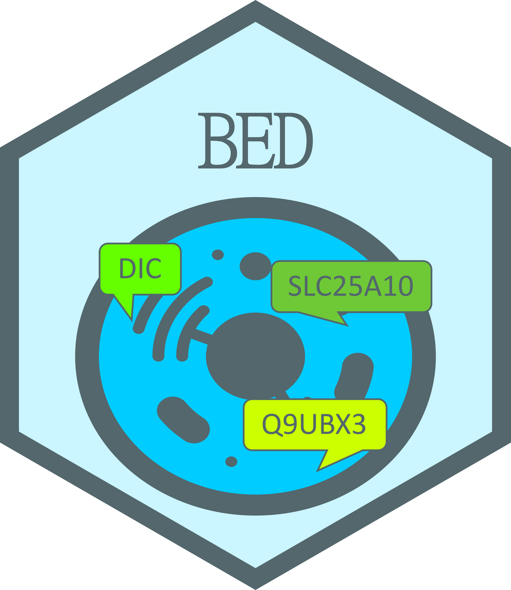

```{r setup, include = FALSE}
library(knitr)
library(here)
library(BED)
library(dplyr)
cranRef <- function(x){
  sprintf(
    "[%s](https://CRAN.R-project.org/package=%s): %s",
    x, x, packageDescription(x)$Title
  )
}
```

# Biological Entity Dictionary 


[](https://cran.r-project.org/package=BED)
[](https://cran.r-project.org/package=BED)

`r packageDescription("BED")$Description`


<!----------------------------------------------------------------------------->
<!----------------------------------------------------------------------------->
## Installation

### From CRAN

```{r, eval=FALSE}
install.packages("BED")
```

### Dependencies

The following R packages available on CRAN are required:

```{r, echo=FALSE, results='asis'}
deps <- desc::desc_get_deps()
sdeps <- filter(deps, type %in% c("Depends", "Imports") & package!="R")
for(p in sdeps$package){
   cat(paste("-", cranRef(p)), sep="\n")
}
```

And those are suggested:

```{r, echo=FALSE, results='asis'}
wdeps <- filter(deps, type=="Suggests" & package!="R")
for(p in wdeps$package){
   cat(paste("-", cranRef(p)), sep="\n")
}
```

### Installation from github

```{r, eval=FALSE}
devtools::install_github("patzaw/BED")
```

### Possible issue when updating from releases <= 1.3.0

If you get an error like the following...

```
Error: package or namespace load failed for ‘BED’:
 .onLoad failed in loadNamespace() for 'BED', details:
  call: connections[[connection]][["cache"]]
  error: subscript out of bounds
```

... remove the BED folder located here:

```{r, echo=TRUE, eval=FALSE}
file.exists(file.path(Sys.getenv("HOME"), "R", "BED"))
```

<!----------------------------------------------------------------------------->
<!----------------------------------------------------------------------------->
## Documentation

Documentation is provided in
the [BED](https://patzaw.github.io/BED/articles/BED.html) vignette.

A public instance of the [BED Neo4j database](#available-bed-database-instance)
is provided for convenience and can be reached as follows:

```{r, eval=FALSE}
library(BED)
connectToBed("https://genodesy.org/BED/", remember=TRUE, useCache=TRUE)
findBeids()
```

<!----------------------------------------------------------------------------->
<!----------------------------------------------------------------------------->
## Citing BED

This package and the underlying research has been published in
this peer reviewed article:

<a href="`r citation("BED")[1]$url`" target="_blank">
`r sub('[[]', '(', sub('[]]', ')', format(citation("BED"), style="textVersion")))`
</a>

<!----------------------------------------------------------------------------->
<!----------------------------------------------------------------------------->
## Available BED database instance

An instance of the BED database (UCB-Human)
has been built using the script provided
in the BED R package.

This instance
is focused on *Homo sapiens*, *Mus musculus*, *Rattus norvegicus*,
*Sus scrofa* and *Danio rerio* organisms.
It has been built from the following resources:

   - Ensembl
   - NCBI
   - Uniprot
   - HGNC
   - GEOquery
   
```{r, echo=FALSE}
config <- jsonlite::read_json(
  here("supp/Build/Genodesy-instance/deploy_config.json")
)
zr <- config$ZENODO_RECORD
```


The Neo4j graph database is available as a dump file shared
in [Zenodo](https://zenodo.org/records/`r zr`).

The following shell commands can be adapted according to user needs and called
to get a running Neo4j container with a BED database instance.

```{r, echo=FALSE, results='asis'}
ec <- readLines(here("supp/Build/S21-Deploy-from-Zenodo.sh"))
torm <- grep("^### usage: ", ec, value=FALSE)
stopifnot(length(torm) == 1)
torm <- c(torm, torm+1)
clines <- grep("## Config ----", ec)
stopifnot(length(clines) == 1)
clines <- seq(
  clines,
  grep("#+@", ec)[which(grep("#+@", ec) > clines)][1],
  by = 1
)
torm <- c(torm, clines)
ec <- ec[-torm]
for(n in names(config)){
  ec <- gsub(paste0("[$][{]?", n, "[}]?"), config[[n]], ec)
}
ec <- gsub("___ROOT___", "~", ec)
##
cat('```sh', sep="\n")
cat(ec, sep="\n")
cat('```', sep="\n")
```

<!----------------------------------------------------------------------------->
<!----------------------------------------------------------------------------->
## Build a BED database instance

Building and feeding a BED database instance is achieved using scripts
available in the "supp/Build" folder.

### Run a neo4j docker images

Using the S01-NewBED-Container.sh script.

### Build and feed BED

Using the S02-Rebuild-BED.sh script which compile the Rebuild-BED.Rmd document.

### Dump the graph DB content for sharing

Using the S03-Dump-BED.sh script

<!----------------------------------------------------------------------------->
<!----------------------------------------------------------------------------->
## Docker notes

[Sergio Espeso-Gil](https://github.com/sespesogil) has reported stability
issues with Docker images in Windows. It's mainly solved by
checking the "Use the WSL2 based engine" options in docker settings.
More information is provided
here: https://docs.docker.com/docker-for-windows/wsl/
