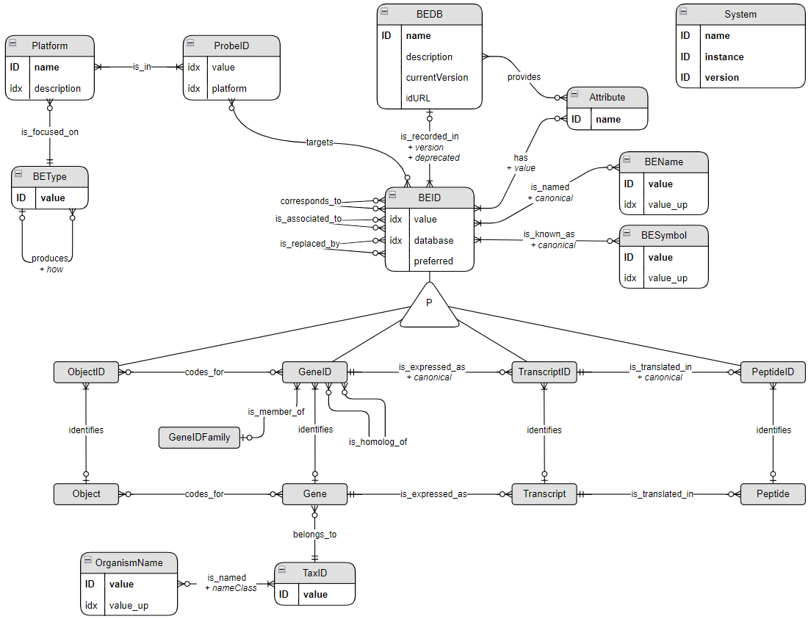

# Biological Entity Dictionary (BED): exploring and converting identifiers of biological entities such as genes, transcripts or peptides


## Introduction

This Biological Entity Dictionary (BED) has been developed to address
three main challenges. The first one is related to the completeness of
identifier mappings. Indeed, direct mapping information provided by the
different systems are not always complete and can be enriched by
mappings provided by other resources. More interestingly, direct
mappings not identified by any of these resources can be indirectly
inferred by using mappings to a third reference. For example, many human
Ensembl gene ID are not directly mapped to any Entrez gene ID but such
mappings can be inferred using respective mappings to HGNC ID. The
second challenge is related to the mapping of deprecated identifiers.
Indeed, entity identifiers can change from one resource release to
another. The identifier history is provided by some resources, such as
Ensembl or the NCBI, but it is generally not used by mapping tools. The
third challenge is related to the automation of the mapping process
according to the relationships between the biological entities of
interest. Indeed, mapping between gene and protein ID scopes should not
be done the same way than between two scopes regarding gene ID. Also,
converting identifiers from different organisms should be possible using
gene orthologs information.

This document shows how to use the **BED (Biological Entity
Dictionary)** R package to get and explore mapping between identifiers
of biological entities (BE). This package provides a way to connect to a
BED Neo4j database in which the relationships between the identifiers
from different sources are recorded.

### Citing BED

This package and the underlying research has been published in this peer
reviewed article:

[Patrice Godard and Jonathan van Eyll (2018). BED: a Biological Entity
Dictionary based on a graph data model (version 3; peer review: 2
approved). F1000Research,
7:195.](https://doi.org/10.12688/f1000research.13925.3)

### Installation

#### Dependencies

This BED package depends on the following packages available in the CRAN
repository:

- **neo2R**
- **visNetwork**
- **dplyr**
- **readr**
- **stringr**
- **utils**
- **shiny**
- **DT**
- **miniUI**
- **rstudioapi**

All these packages must be installed before installing BED.

#### Installation from github

``` r
devtools::install_github("patzaw/BED")
```

#### Possible issue when updating from releases \<= 1.3.0

If you get an error like the following…

    Error: package or namespace load failed for ‘BED’:
     .onLoad failed in loadNamespace() for 'BED', details:
      call: connections[[connection]][["cache"]]
      error: subscript out of bounds

… remove the BED folder located here:

``` r
file.exists(file.path(Sys.getenv("HOME"), "R", "BED"))
```

### Connection

Before using BED, the connection needs to be established with the
underlying Neo4j DB. `url`, `username` and `password` should be adapted.

``` r
library(BED)
```

``` r
connectToBed(url="localhost:5454", remember=FALSE, useCache=FALSE)
```

The `remember` parameter can be set to `TRUE` in order to save
connection information that will be automatically used the next time the
[`connectToBed()`](https://patzaw.github.io/BED/reference/connectToBed.md)
function is called. By default, this parameter is set to `FALSE` to
comply with CRAN policies. Saved connection can be managed with the
[`lsBedConnections()`](https://patzaw.github.io/BED/reference/lsBedConnections.md)
and the
[`forgetBedConnection()`](https://patzaw.github.io/BED/reference/forgetBedConnection.md)
functions.

The `useCache` parameter is by default set to `FALSE` to comply with
CRAN policies. However, it is recommended to set it to `TRUE` to improve
the speed of recurrent queries: the results of some large queries are
saved locally in a file.

The connection can be checked the following way.

``` r
checkBedConn(verbose=TRUE)
```

    ## https://genodesy.org/BED

    ## BED

    ## Genodesy-Human

    ## 2025.09.18

    ## Cache ON

    ## [1] TRUE
    ## attr(,"dbVersion")
    ##   name       instance    version
    ## 1  BED Genodesy-Human 2025.09.18

If the `verbose` parameter is set to TRUE, the URL and the content
version are displayed as messages.

The following function list saved connections.

``` r
lsBedConnections()
```

The `connection` param of the `connectToBed` function can be used to
connect to a saved connection other than the last one.

### Data model

The BED underlying data model can be shown at any time using the
following command.

``` r
showBedDataModel()
```



### Direct calls

Cypher queries can be run directly on the Neo4j database using the
`cypher` function from the **neo2R** package through the `bedCall`
function.

``` r
results <- bedCall(
    cypher,
    query=prepCql(
       'MATCH (n:BEID)',
       'WHERE n.value IN $values',
       'RETURN DISTINCT n.value AS value, labels(n), n.database'
    ),
    parameters=list(values=c("10", "100"))
)
results
```

    ##   value      labels(n) n.database
    ## 1    10 BEID || GeneID EntrezGene
    ## 2   100 BEID || GeneID EntrezGene
    ## 3   100 BEID || GeneID       HGNC

### Feeding the database

Many functions are provided within the package to build your own BED
database instance. These functions are not exported in order to avoid
their use when interacting with BED normally. Information about how to
get an instance of the BED neo4j database is provided here:

- <https://github.com/patzaw/BED#bed-database-instance-available-as-a-docker-image>
- <https://github.com/patzaw/BED#build-a-bed-database-instance>

It can be adapted to user needs.

### Caching

This part is relevant if the `useCache` parameter is set to TRUE when
calling
[`connectToBed()`](https://patzaw.github.io/BED/reference/connectToBed.md).

Functions of the BED package used to retrieve thousands of identifiers
can take some time (generally a few seconds) before returning a result.
Thus for this kind of query, the query is run for all the relevant ID in
the DB and thanks to a cache system implemented in the package same
queries with different filters should be much faster the following
times.

By default the cache is flushed when the system detect inconsistencies
with the BED database. However, it can also be manualy flushed if needed
using the
[`clearBedCache()`](https://patzaw.github.io/BED/reference/clearBedCache.md)
function.

Queries already in cache can be listed using the
[`lsBedCache()`](https://patzaw.github.io/BED/reference/lsBedCache.md)
function which also return the occupied disk space.

## Exploring available data

### Biological entities

BED is organized around the central concept of **Biological Entity**
(BE). All supported types of BE can be listed.

``` r
listBe()
```

    ## [1] "Gene"       "Transcript" "Peptide"    "Object"

These BE are organized according to how they are related to each other.
For example a *Gene* *is_expressed_as* a *Transcript*. This organization
allows to find the first upstream BE common to a set of BE.

``` r
firstCommonUpstreamBe(c("Object", "Transcript"))
```

    ## [1] "Gene"

``` r
firstCommonUpstreamBe(c("Peptide", "Transcript"))
```

    ## [1] "Transcript"

### Organisms

Several organims can be supported by the BED underlying database. They
can be listed the following way.

``` r
listOrganisms()
```

    ## [1] "Danio rerio"       "Homo sapiens"      "Sus scrofa"       
    ## [4] "Mus musculus"      "Rattus norvegicus"

Common names are also supported and the corresponding taxonomic
identifiers can be retrieved. Conversely the organism names
corresponding to a taxonomic ID can be listed.

``` r
getOrgNames(getTaxId("human"))
```

    ##   taxID                        name           nameClass
    ## 1  9606 Homo sapiens Linnaeus, 1758           authority
    ## 2  9606                       human genbank common name
    ## 3  9606                Homo sapiens     scientific name

### Identifiers of biological entities

The main aim of BED is to allow the mapping of identifiers from
different sources such as Ensembl or Entrez. Supported sources can be
listed the following way for each supported organism.

``` r
listBeIdSources(be="Transcript", organism="human")
```

    ##             database   nbBe   nbId         be
    ## 1 BEDTech_transcript 114459 114459 Transcript
    ## 2             RefSeq 268000 278120 Transcript
    ## 3     Ens_transcript 530356 544475 Transcript

The database gathering the largest number of BE of specific type can
also be identified.

``` r
largestBeSource(be="Transcript", organism="human", restricted=TRUE)
```

    ## [1] "Ens_transcript"

Finally, the
[`getAllBeIdSources()`](https://patzaw.github.io/BED/reference/getAllBeIdSources.md)
function returns all the source databases of BE identifiers whatever the
BE type.

### Experimental platforms and probes

BED also supports experimental platforms and provides mapping betweens
probes and BE identifiers (BEID).

The supported platforms can be listed the following way. The
[`getTargetedBe()`](https://patzaw.github.io/BED/reference/getTargetedBe.md)
function returns the type of BE on which a specific platform focus.

``` r
head(listPlatforms())
```

    ##              name                                        description focus
    ## GPL6101   GPL6101        Illumina ratRef-12 v1.0 expression beadchip  Gene
    ## GPL6887   GPL6887        Illumina MouseWG-6 v2.0 expression beadchip  Gene
    ## GPL6947   GPL6947       Illumina HumanHT-12 V3.0 expression beadchip  Gene
    ## GPL10558 GPL10558       Illumina HumanHT-12 V4.0 expression beadchip  Gene
    ## GPL1355   GPL1355     [Rat230_2] Affymetrix Rat Genome 230 2.0 Array  Gene
    ## GPL1261   GPL1261 [Mouse430_2] Affymetrix Mouse Genome 430 2.0 Array  Gene

``` r
getTargetedBe("GPL570")
```

    ## [1] "Gene"

## Managing identifiers

### Retrieving all identifiers from a source

All identifiers of an organism BEs from one source can be retrieved.

``` r
beids <- getBeIds(
    be="Gene", source="EntrezGene", organism="human",
    restricted=FALSE
)
dim(beids)
```

    ## [1] 216442      5

``` r
head(beids)
```

    ##     id preferred   Gene db.version db.deprecated
    ## 1 4535     FALSE 936327   20250918         FALSE
    ## 2 4536     FALSE 936331   20250918         FALSE
    ## 3 4512     FALSE 936337   20250918         FALSE
    ## 4 4513     FALSE 936340   20250918         FALSE
    ## 5 4509     FALSE 936342   20250918         FALSE
    ## 6 4508     FALSE 936343   20250918         FALSE

The first column, *id*, corresponds to the identifiers of the BE in the
source. The column named according to the BE type (in this case *Gene*)
corresponds to the internal identifier of the related BE. **BE CAREFUL,
THIS INTERNAL ID IS NOT STABLE AND CANNOT BE USED AS A REFERENCE**. This
internal identifier is useful to identify BEIDS corresponding to the
same BE. The following code can be used to have an overview of such
redundancy.

``` r
sort(table(table(beids$Gene)), decreasing = TRUE)
```

    ## 
    ##      1      2      3      4      5      6      7      8      9     10     11 
    ## 178373   9825   3183   1065    404    160     91     47     26     10     10 
    ##     12     13     14     16     31 
    ##      6      2      2      1      1

``` r
ambId <- sum(table(table(beids$Gene)[which(table(beids$Gene)>=10)]))
```

In the example above we can see that most of Gene BE are identified by
only one EntrezGene ID. However many of them are identified by two or
more ID; 32 BE are even identified by 10 or more EntrezGeneID. In this
case, most of these redundancies come from ID history extracted from
Entrez. Legacy ID can be excluded from the retrieved ID by setting the
`restricted` parameter to TRUE.

``` r
beids <- getBeIds(
    be="Gene", source="EntrezGene", organism="human",
    restricted = TRUE
)
dim(beids)
```

    ## [1] 193625      5

The same code as above can be used to identify remaining redundancies.

``` r
sort(table(table(beids$Gene)), decreasing = TRUE)
```

    ## 
    ##      1      2      3      4 
    ## 192814    367     23      2

In the example above we can see that allmost all Gene BE are identified
by only one EntrezGene ID. However some of them are identified by two or
more ID. This result comes from how the BED database is constructed
according to the ID mapping provided by the different source databases.
The graph below shows how the mapping was done for such a BE with
redundant EntrezGene IDs.

**This issue has been mainly solved by not taking into account ambigous
mappings between NCBI Entrez gene identifiers and Ensembl gene
identifier provided by Ensembl. It has been achieved using the
[`cleanDubiousXRef()`](https://patzaw.github.io/BED/reference/cleanDubiousXRef.md)
function from the 2019.10.11 version of the BED-UCB-Human database.**

``` r
eid <- beids$id[which(beids$Gene %in% names(which(table(beids$Gene)>=3)))][1]
print(eid)
```

    ## [1] "123258400"

``` r
exploreBe(id=eid, source="EntrezGene", be="Gene") %>%
   visPhysics(solver="repulsion")
```

  

The way the ID correspondances are reported in the different source
databases leads to this mapping ambiguity which has to be taken into
account when comparing identifiers from different databases.

The [`getBeIds()`](https://patzaw.github.io/BED/reference/getBeIds.md)
returns other columns providing additional information about the *id*.
The same function can be used to retrieved symbols or probe identifiers.

#### Preferred identifier

The BED database is constructed according to the relationships between
identifiers provided by the different sources. Biological entities (BE)
are identified as clusters of identifiers which correspond to each other
directly or indirectly (`corresponds_to` relationship). Because of this
design a BE can be identified by multiple identifiers (BEID) from the
same database as shown above. These BEID are often related to alternate
version of an entity.

For example, Ensembl provides different version (alternative sequences)
of some chromosomes parts. And genes are also annotated on these
alternative sequences. In Uniprot some *unreviewed* identifiers can
correspond to *reviewed* proteins.

When available such kind of information is associated to an
**Attribute** node through a `has` relationship providing the value of
the attribute for the BEID. This information can also be used to define
if a BEID is a *preferred* identifier for a BE.

The example below shows the case of the MAPT gene annotated on different
version of human chromosome 17.

``` r
mapt <- convBeIds(
   "MAPT", from="Gene", from.source="Symbol", from.org="human",
   to.source="Ens_gene", restricted=TRUE
)
exploreBe(
   mapt[1, "to"],
   source="Ens_gene",
   be="Gene"
)
```

``` r
getBeIds(
   be="Gene", source="Ens_gene", organism="human",
   restricted=TRUE,
   attributes=listDBAttributes("Ens_gene"),
   filter=mapt$to
)
```

    ##                id preferred    Gene db.version db.deprecated
    ## 1 ENSG00000186868      TRUE 7576095        115         FALSE
    ## 2 ENSG00000276155     FALSE 7576095        115         FALSE
    ## 3 ENSG00000277956     FALSE 7576095        115         FALSE
    ## 4         LRG_660     FALSE 7576095        115         FALSE
    ##                       seq_region
    ## 1           GRCh38 chromosome 17
    ## 2 GRCh38 scaffold HSCHR17_1_CTG5
    ## 3 GRCh38 scaffold HSCHR17_2_CTG5
    ## 4                    lrg LRG_660

### Checking identifiers

The origin of identifiers can be guessed as following.

``` r
oriId <- c(
    "17237", "105886298", "76429", "80985", "230514", "66459",
    "93696", "72514", "20352", "13347", "100462961", "100043346",
    "12400", "106582", "19062", "245607", "79196", "16878", "320727",
    "230649", "66880", "66245", "103742", "320145", "140795"
)
idOrigin <- guessIdScope(oriId)
print(idOrigin$be)
```

    ## [1] "Gene"

``` r
print(idOrigin$source)
```

    ## [1] "EntrezGene"

``` r
print(idOrigin$organism)
```

    ## [1] "Mus musculus"

The best guess is returned as a list but other possible origins are
listed in the *details* attribute.

``` r
print(attr(idOrigin, "details"))
```

    ##     be     source     organism nb proportion
    ## 1 Gene EntrezGene Mus musculus 25       1.00
    ## 2 Gene       HGNC Homo sapiens  3       0.12
    ## 3 Gene        MGI Mus musculus  2       0.08

If the origin of identifiers is already known, it can also be tested.

``` r
checkBeIds(ids=oriId, be="Gene", source="EntrezGene", organism="mouse")
```

``` r
checkBeIds(ids=oriId, be="Gene", source="HGNC", organism="human")
```

    ## Warning in checkBeIds(ids = oriId, be = "Gene", source = "HGNC", organism =
    ## "human"): Could not find 22 IDs among 25!

### Identifier annotation

Identifiers can be annotated with symbols and names according to
available information. The following code returns the most relevant
symbol and the most relevant name for each ID. Source URL can also be
generated with the
[`getBeIdURL()`](https://patzaw.github.io/BED/reference/getBeIdURL.md)
function.

``` r
toShow <- getBeIdDescription(
    ids=oriId, be="Gene", source="EntrezGene", organism="mouse"
)
toShow$id <- paste0(
    sprintf(
        '<a href="%s" target="_blank">',
        getBeIdURL(toShow$id, "EntrezGene")
    ),
    toShow$id,
    '<a>'
)
kable(toShow, escape=FALSE, row.names=FALSE)
```

| id | symbol | name | preferred | db.version | db.deprecated |
|:---|:---|:---|:---|:---|:---|
| [17237](https://www.ncbi.nlm.nih.gov/gene/17237) | Mgrn1 | mahogunin, ring finger 1 | TRUE | 20250918 | FALSE |
| [105886298](https://www.ncbi.nlm.nih.gov/gene/105886298) | Cmc4 | C-X9-C motif containing 4 | TRUE | 20250918 | FALSE |
| [76429](https://www.ncbi.nlm.nih.gov/gene/76429) | Lhpp | phospholysine phosphohistidine inorganic pyrophosphate phosphatase | TRUE | 20250918 | FALSE |
| [80985](https://www.ncbi.nlm.nih.gov/gene/80985) | Trim44 | tripartite motif-containing 44 | TRUE | 20250918 | FALSE |
| [230514](https://www.ncbi.nlm.nih.gov/gene/230514) | Leprot | leptin receptor overlapping transcript | TRUE | 20250918 | FALSE |
| [66459](https://www.ncbi.nlm.nih.gov/gene/66459) | Pyurf | Pigy upstream reading frame | TRUE | 20250918 | FALSE |
| [93696](https://www.ncbi.nlm.nih.gov/gene/93696) | Chrac1 | chromatin accessibility complex 1 | TRUE | 20250918 | FALSE |
| [72514](https://www.ncbi.nlm.nih.gov/gene/72514) | Fgfbp3 | fibroblast growth factor binding protein 3 | TRUE | 20250918 | FALSE |
| [20352](https://www.ncbi.nlm.nih.gov/gene/20352) | Sema4b | sema domain, immunoglobulin domain (Ig), transmembrane domain (TM) and short cytoplasmic domain, (semaphorin) 4B | TRUE | 20250918 | FALSE |
| [13347](https://www.ncbi.nlm.nih.gov/gene/13347) | Dffa | DNA fragmentation factor, alpha subunit | TRUE | 20250918 | FALSE |
| [100462961](https://www.ncbi.nlm.nih.gov/gene/100462961) | Gm16149 | predicted gene 16149 | TRUE | 20250918 | FALSE |
| [100043346](https://www.ncbi.nlm.nih.gov/gene/100043346) | Rpl10-ps3 | ribosomal protein L10, pseudogene 3 | TRUE | 20250918 | FALSE |
| [12400](https://www.ncbi.nlm.nih.gov/gene/12400) | Cbfb | core binding factor beta | TRUE | 20250918 | FALSE |
| [106582](https://www.ncbi.nlm.nih.gov/gene/106582) | Nrm | nurim (nuclear envelope membrane protein) | TRUE | 20250918 | FALSE |
| [19062](https://www.ncbi.nlm.nih.gov/gene/19062) | Inpp5k | inositol polyphosphate 5-phosphatase K | TRUE | 20250918 | FALSE |
| [245607](https://www.ncbi.nlm.nih.gov/gene/245607) | Gprasp2 | G protein-coupled receptor associated sorting protein 2 | TRUE | 20250918 | FALSE |
| [79196](https://www.ncbi.nlm.nih.gov/gene/79196) | Osbpl5 | oxysterol binding protein-like 5 | TRUE | 20250918 | FALSE |
| [16878](https://www.ncbi.nlm.nih.gov/gene/16878) | Lif | leukemia inhibitory factor | TRUE | 20250918 | FALSE |
| [320727](https://www.ncbi.nlm.nih.gov/gene/320727) | Ipo8 | importin 8 | TRUE | 20250918 | FALSE |
| [230649](https://www.ncbi.nlm.nih.gov/gene/230649) | Atpaf1 | ATP synthase mitochondrial F1 complex assembly factor 1 | TRUE | 20250918 | FALSE |
| [66880](https://www.ncbi.nlm.nih.gov/gene/66880) | Rsrc1 | arginine/serine-rich coiled-coil 1 | TRUE | 20250918 | FALSE |
| [66245](https://www.ncbi.nlm.nih.gov/gene/66245) | Hspbp1 | HSPA (heat shock 70kDa) binding protein, cytoplasmic cochaperone 1 | TRUE | 20250918 | FALSE |
| [103742](https://www.ncbi.nlm.nih.gov/gene/103742) | Mien1 | migration and invasion enhancer 1 | TRUE | 20250918 | FALSE |
| [320145](https://www.ncbi.nlm.nih.gov/gene/320145) | Sp8 | trans-acting transcription factor 8 | TRUE | 20250918 | FALSE |
| [140795](https://www.ncbi.nlm.nih.gov/gene/140795) | P2ry14 | purinergic receptor P2Y, G-protein coupled, 14 | TRUE | 20250918 | FALSE |

All possible symbols and all possible names for each ID can also be
retrieved using the following functions.

``` r
res <- getBeIdSymbols(
    ids=oriId, be="Gene", source="EntrezGene", organism="mouse",
    restricted=FALSE
)
head(res)
```

    ##       id        symbol canonical direct preferred  entity
    ## 1 245607         GASP2     FALSE   TRUE      TRUE 3870155
    ## 2 245607 5330440H13Rik     FALSE   TRUE      TRUE 3870155
    ## 3 245607        GASP-2     FALSE   TRUE      TRUE 3870155
    ## 4 245607         Prpl5     FALSE   TRUE      TRUE 3870155
    ## 5 245607       Gprasp2      TRUE   TRUE      TRUE 3870155
    ## 6  66880        SRrp53     FALSE   TRUE      TRUE 3877032

``` r
res <- getBeIdNames(
    ids=oriId, be="Gene", source="EntrezGene", organism="mouse",
    restricted=FALSE
)
head(res)
```

    ##       id                                                    name canonical
    ## 1 245607 G-protein coupled receptor-associated sorting protein 2     FALSE
    ## 2 245607                                  prion protein ligand 5     FALSE
    ## 3 245607 G protein-coupled receptor associated sorting protein 2      TRUE
    ## 4  66880                      serine/Arginine-related protein 53     FALSE
    ## 5  66880              arginine/serine-rich coiled-coil protein 1     FALSE
    ## 6  66880                      arginine/serine-rich coiled-coil 1      TRUE
    ##   direct preferred  entity
    ## 1   TRUE      TRUE 3870155
    ## 2   TRUE      TRUE 3870155
    ## 3   TRUE      TRUE 3870155
    ## 4   TRUE      TRUE 3877032
    ## 5   TRUE      TRUE 3877032
    ## 6   TRUE      TRUE 3877032

Also probes and some biological entities do not have directly associated
symbols or names. These elements can also be annotated according to
information related to relevant genes.

``` r
someProbes <- c(
    "238834_at", "1569297_at", "213021_at", "225480_at",
    "216016_at", "35685_at", "217969_at", "211359_s_at"
)
toShow <- getGeneDescription(
    ids=someProbes, be="Probe", source="GPL570", organism="human"
)
kable(toShow, escape=FALSE, row.names=FALSE)
```

| id | EntrezGene | symbol | name |
|:---|:---|:---|:---|
| 238834_at | 91807 | MYLK3 | myosin light chain kinase 3 |
| 1569297_at | 731779 | LINC01300 | long intergenic non-protein coding RNA 1300 |
| 213021_at | 9527 | GOSR1 | golgi SNAP receptor complex member 1 |
| 225480_at | 127687 | C1orf122 | chromosome 1 open reading frame 122 |
| 216016_at | 114548 | NLRP3 | NLR family pyrin domain containing 3 |
| 35685_at | 6015 | RING1 | ring finger protein 1 |
| 217969_at | 738 | VPS51 | VPS51 subunit of GARP complex |
| 211359_s_at | 4988 | OPRM1 | opioid receptor mu 1 |

### Products of molecular biology processes

The BED data model has beeing built to fulfill molecular biology
processes:

- **is_expressed_as** relationships correspond to the transcription
  process.
- **is_translated_in** relationships correspond to the translation
  process.
- **codes_for** is a fuzzy relationship allowing the mapping of genes on
  object not necessary corresonpding to the same kind of biological
  molecule.

These processes are described in different databases with different
level of granularity. For exemple, Ensembl provides possible transcripts
for each gene specifying which one of them is canonical.

The following functions are used to retrieve direct products or direct
origins of molecular biology processes.

``` r
getDirectProduct("ENSG00000145335", process="is_expressed_as")
```

    ##             origin  osource         product        psource canonical
    ## 1  ENSG00000145335 Ens_gene ENST00000345009 Ens_transcript     FALSE
    ## 2  ENSG00000145335 Ens_gene ENST00000673902 Ens_transcript     FALSE
    ## 3  ENSG00000145335 Ens_gene ENST00000912365 Ens_transcript     FALSE
    ## 4  ENSG00000145335 Ens_gene ENST00000965189 Ens_transcript     FALSE
    ## 5  ENSG00000145335 Ens_gene ENST00000502987 Ens_transcript     FALSE
    ## 6  ENSG00000145335 Ens_gene ENST00000506691 Ens_transcript     FALSE
    ## 7  ENSG00000145335 Ens_gene ENST00000965188 Ens_transcript     FALSE
    ## 8  ENSG00000145335 Ens_gene ENST00000394986 Ens_transcript     FALSE
    ## 9  ENSG00000145335 Ens_gene ENST00000889659 Ens_transcript     FALSE
    ## 10 ENSG00000145335 Ens_gene ENST00000965192 Ens_transcript     FALSE
    ## 11 ENSG00000145335 Ens_gene ENST00000505199 Ens_transcript     FALSE
    ## 12 ENSG00000145335 Ens_gene ENST00000889658 Ens_transcript     FALSE
    ## 13 ENSG00000145335 Ens_gene ENST00000889657 Ens_transcript     FALSE
    ## 14 ENSG00000145335 Ens_gene ENST00000889660 Ens_transcript     FALSE
    ## 15 ENSG00000145335 Ens_gene ENST00000674129 Ens_transcript     FALSE
    ## 16 ENSG00000145335 Ens_gene ENST00000336904 Ens_transcript     FALSE
    ## 17 ENSG00000145335 Ens_gene ENST00000508895 Ens_transcript     FALSE
    ## 18 ENSG00000145335 Ens_gene ENST00000912364 Ens_transcript     FALSE
    ## 19 ENSG00000145335 Ens_gene ENST00000673718 Ens_transcript     FALSE
    ## 20 ENSG00000145335 Ens_gene ENST00000889663 Ens_transcript     FALSE
    ## 21 ENSG00000145335 Ens_gene ENST00000611107 Ens_transcript     FALSE
    ## 22 ENSG00000145335 Ens_gene ENST00000965191 Ens_transcript     FALSE
    ## 23 ENSG00000145335 Ens_gene ENST00000506244 Ens_transcript     FALSE
    ## 24 ENSG00000145335 Ens_gene ENST00000673766 Ens_transcript     FALSE
    ## 25 ENSG00000145335 Ens_gene ENST00000618500 Ens_transcript     FALSE
    ## 26 ENSG00000145335 Ens_gene ENST00000394989 Ens_transcript     FALSE
    ## 27 ENSG00000145335 Ens_gene ENST00000965186 Ens_transcript     FALSE
    ## 28 ENSG00000145335 Ens_gene ENST00000420646 Ens_transcript     FALSE
    ## 29 ENSG00000145335 Ens_gene ENST00000965190 Ens_transcript     FALSE
    ## 30 ENSG00000145335 Ens_gene ENST00000965187 Ens_transcript     FALSE
    ## 31 ENSG00000145335 Ens_gene ENST00000889662 Ens_transcript     FALSE
    ## 32 ENSG00000145335 Ens_gene ENST00000394991 Ens_transcript      TRUE

``` r
getDirectProduct("ENST00000336904", process="is_translated_in")
```

    ##            origin        osource         product         psource canonical
    ## 1 ENST00000336904 Ens_transcript ENSP00000338345 Ens_translation      TRUE

``` r
getDirectOrigin("NM_001146055", process="is_expressed_as")
```

    ##   origin    osource      product psource canonical
    ## 1   6622 EntrezGene NM_001146055  RefSeq     FALSE

## Converting identifiers

### Same entity and same organism: from one source to another

``` r
res <- convBeIds(
    ids=oriId,
    from="Gene",
    from.source="EntrezGene",
    from.org="mouse",
    to.source="Ens_gene",
    restricted=TRUE,
    prefFilter=TRUE
)
head(res)
```

    ##        from                 to to.preferred to.entity
    ## 1     19062 ENSMUSG00000006127         TRUE   3854072
    ## 2    103742 ENSMUSG00000002580         TRUE   3856051
    ## 3    320145 ENSMUSG00000048562         TRUE   3858138
    ## 4 105886298 ENSMUSG00000090110         TRUE   3860744
    ## 5    320727 ENSMUSG00000040029         TRUE   3861437
    ## 6     17237 ENSMUSG00000022517         TRUE   3862906

### Same organism: from one entity to another

``` r
res <- convBeIds(
    ids=oriId,
    from="Gene",
    from.source="EntrezGene",
    from.org="mouse",
    to="Peptide",
    to.source="Ens_translation",
    restricted=TRUE,
    prefFilter=TRUE
)
head(res)
```

    ##         from                 to to.preferred to.entity
    ## 1      19062 ENSMUSP00000119996         TRUE   5300956
    ## 2      19062 ENSMUSP00000121060         TRUE   5300958
    ## 3     320145 ENSMUSP00000152523         TRUE   5306173
    ## 7  105886298 ENSMUSP00000033543         TRUE   5309613
    ## 10 105886298 ENSMUSP00000112753         TRUE   5309613
    ## 4  105886298 ENSMUSP00000117381         TRUE   5309613

### From one organism to another

``` r
res <- convBeIds(
    ids=oriId,
    from="Gene",
    from.source="EntrezGene",
    from.org="mouse",
    to="Peptide",
    to.source="Ens_translation",
    to.org="human",
    restricted=TRUE,
    prefFilter=TRUE
)
head(res)
```

    ##       from              to to.preferred to.entity
    ## 229 106582 ENSP00000397892         TRUE   3328802
    ## 115 230514 ENSP00000497944         TRUE   3333609
    ## 116 230514 ENSP00000497385         TRUE   3333625
    ## 117 230514 ENSP00000497374         TRUE   3333629
    ## 118 230514 ENSP00000483521         TRUE   3333634
    ## 120 245607 ENSP00000577116         TRUE   3355120

### Converting lists of identifiers

List of identifiers can be converted the following way. Only converted
IDs are returned in this case.

``` r
humanEnsPeptides <- convBeIdLists(
    idList=list(a=oriId[1:5], b=oriId[-c(1:5)]),
    from="Gene",
    from.source="EntrezGene",
    from.org="mouse",
    to="Peptide",
    to.source="Ens_translation",
    to.org="human",
    restricted=TRUE,
    prefFilter=TRUE
)
unlist(lapply(humanEnsPeptides, length))
```

    ##   a   b 
    ##  43 235

``` r
lapply(humanEnsPeptides, head)
```

    ## $a
    ## [1] "ENSP00000497944" "ENSP00000497385" "ENSP00000497374" "ENSP00000483521"
    ## [5] "ENSP00000560936" "ENSP00000560937"
    ## 
    ## $b
    ## [1] "ENSP00000397892" "ENSP00000577116" "ENSP00000577117" "ENSP00000577118"
    ## [5] "ENSP00000577119" "ENSP00000577120"

#### BEIDList

`BEIDList` objects are used to manage lists of BEID with an attached
explicit scope, and metadata provided in a data frame. The
[`focusOnScope()`](https://patzaw.github.io/BED/reference/focusOnScope.md)
function is used to easily convert such object to another scope. For
example, in the code below, Entrez gene identifiers are converted in
Ensembl identifiers.

``` r
entrezGenes <- BEIDList(
   list(a=oriId[1:5], b=oriId[-c(1:5)]),
   scope=list(be="Gene", source="EntrezGene", organism="Mus musculus"),
   metadata=data.frame(
      .lname=c("a", "b"),
      description=c("Identifiers in a", "Identifiers in b"),
      stringsAsFactors=FALSE
   )
)
entrezGenes
```

    ## BEIDList of 2 elements gathering 25 BEIDs in total
    ##    - Scope: be="Gene", source="EntrezGene", organism="Mus musculus"
    ##    - Metadata fields: ".lname", "description"

``` r
entrezGenes$a
```

    ## [1] "17237"     "105886298" "76429"     "80985"     "230514"

``` r
ensemblGenes <- focusOnScope(entrezGenes, source="Ens_gene")
ensemblGenes$a
```

    ## [1] "ENSMUSG00000090110" "ENSMUSG00000022517" "ENSMUSG00000035212"
    ## [4] "ENSMUSG00000030946" "ENSMUSG00000027189"

### Converting data frames

IDs in data frames can also be converted.

``` r
toConv <- data.frame(a=1:25, b=runif(25))
rownames(toConv) <- oriId
res <- convDfBeIds(
    df=toConv,
    from="Gene",
    from.source="EntrezGene",
    from.org="mouse",
    to.source="Ens_gene",
    restricted=TRUE,
    prefFilter=TRUE
)
head(res)
```

    ##   a           b conv.from            conv.to
    ## 1 1 0.080750138     17237 ENSMUSG00000022517
    ## 2 2 0.834333037 105886298 ENSMUSG00000090110
    ## 3 3 0.600760886     76429 ENSMUSG00000030946
    ## 4 4 0.157208442     80985 ENSMUSG00000027189
    ## 5 5 0.007399441    230514 ENSMUSG00000035212
    ## 6 6 0.466393497     66459 ENSMUSG00000043162

### Explore convertion shortest path between two identifiers

Because the conversion process takes into account several resources, it
might be useful to explore the path between two identifiers which have
been mapped. This can be achieved by the `exploreConvPath` function.

``` r
from.id <- "ILMN_1220595"
res <- convBeIds(
   ids=from.id, from="Probe", from.source="GPL6885", from.org="mouse",
   to="Peptide", to.source="Uniprot", to.org="human",
   prefFilter=TRUE
)
res
```

    ##           from     to to.preferred to.entity
    ## 1 ILMN_1220595 Q16552         TRUE  10733839

``` r
exploreConvPath(
   from.id=from.id, from="Probe", from.source="GPL6885",
   to.id=res$to[1], to="Peptide", to.source="Uniprot"
)
```

The figure above shows how the ILMN_1220595 ProbeID, targeting the mouse
NM_010552 transcript, can be associated to the Q16552 human protein ID
in Uniprot.

### Notes about converting from and to gene symbols

Canonical and non-canonical symbols are associated to genes. In some
cases the same symbol (canonical or not) can be associated to several
genes. This can lead to ambiguous mapping. The strategy to apply for
such mapping depends on the aim of the user and his knowledge about the
origin of the symbols to consider.

The complete mapping between Ensembl gene identifiers and symbols is
retrieved by using the `getBeIDSymbolTable` function.

``` r
compMap <- getBeIdSymbolTable(
   be="Gene", source="Ens_gene", organism="rat",
   restricted=FALSE
)
dim(compMap)
```

    ## [1] 196331      6

``` r
head(compMap)
```

    ##                   id   symbol canonical direct preferred  entity
    ## 1 ENSRNOG00000061595    TFE-C     FALSE   TRUE      TRUE 5553531
    ## 2 ENSRNOG00000061595    rTFEC     FALSE   TRUE      TRUE 5553531
    ## 3 ENSRNOG00000061595    Tcfec     FALSE   TRUE      TRUE 5553531
    ## 4 ENSRNOG00000061595     Tfec      TRUE   TRUE      TRUE 5553531
    ## 5 ENSRNOG00000083125 SNORD115      TRUE   TRUE      TRUE 9829552
    ## 6 ENSRNOG00000072772 SNORD115      TRUE   TRUE      TRUE 9829543

The canonical field indicates if the symbol is canonical for the
identifier. The direct field indicates if the symbol is directly
associated to the identifier or indirectly through a relationship with
another identifier.

As an example, let’s consider the “Snca” symbol in rat. As shown below,
this symbol is associated to 2 genes; it is canonical for one gene and
not for another. These 2 genes are also associated to other symbols.

``` r
sncaEid <- compMap[which(compMap$symbol=="Snca"),]
sncaEid
```

    ##                       id symbol canonical direct preferred  entity
    ## 10326 ENSRNOG00000029408   Snca     FALSE   TRUE      TRUE 5590637
    ## 61458 ENSRNOG00000008656   Snca      TRUE   TRUE      TRUE 5560162

``` r
compMap[which(compMap$id %in% sncaEid$id),]
```

    ##                       id    symbol canonical direct preferred  entity
    ## 10326 ENSRNOG00000029408      Snca     FALSE   TRUE      TRUE 5590637
    ## 10327 ENSRNOG00000029408 LOC317274     FALSE   TRUE      TRUE 5590637
    ## 10328 ENSRNOG00000029408   Mageb16      TRUE   TRUE      TRUE 5590637
    ## 61457 ENSRNOG00000008656 MGC105443     FALSE   TRUE      TRUE 5560162
    ## 61458 ENSRNOG00000008656      Snca      TRUE   TRUE      TRUE 5560162

The `getBeIdDescription` function described before, reports only one
symbol for each identifier. Canonical and direct symbols are
prioritized.

``` r
getBeIdDescription(
   sncaEid$id,
   be="Gene", source="Ens_gene", organism="rat"
)
```

    ##                                    id  symbol                   name preferred
    ## ENSRNOG00000029408 ENSRNOG00000029408 Mageb16 MAGE family member B16      TRUE
    ## ENSRNOG00000008656 ENSRNOG00000008656    Snca        synuclein alpha      TRUE
    ##                    db.version db.deprecated
    ## ENSRNOG00000029408        115         FALSE
    ## ENSRNOG00000008656        115         FALSE

The `convBeIds` works differently in order to provide a mapping as
exhaustive as possible. If a symbol is associated to several input
identifiers, non-canonical associations with this symbol are removed if
a canonical association exists for any other identifier. This can lead
to inconsistent results, depending on the user input, as show below.

``` r
convBeIds(
   sncaEid$id[1],
   from="Gene", from.source="Ens_gene", from.org="rat",
   to.source="Symbol"
)
```

    ##                 from        to to.preferred to.entity
    ## 3 ENSRNOG00000029408 LOC317274           NA   5590637
    ## 2 ENSRNOG00000029408   Mageb16           NA   5590637
    ## 1 ENSRNOG00000029408      Snca           NA   5590637

``` r
convBeIds(
   sncaEid$id[2],
   from="Gene", from.source="Ens_gene", from.org="rat",
   to.source="Symbol"
)
```

    ##                 from        to to.preferred to.entity
    ## 2 ENSRNOG00000008656 MGC105443           NA   5560162
    ## 1 ENSRNOG00000008656      Snca           NA   5560162

``` r
convBeIds(
   sncaEid$id,
   from="Gene", from.source="Ens_gene", from.org="rat",
   to.source="Symbol"
)
```

    ##                 from        to to.preferred to.entity
    ## 2 ENSRNOG00000008656 MGC105443           NA   5560162
    ## 1 ENSRNOG00000008656      Snca           NA   5560162
    ## 5 ENSRNOG00000029408 LOC317274           NA   5590637
    ## 4 ENSRNOG00000029408   Mageb16           NA   5590637

In the example above, when the query is run for each identifier
independently, the association to the “Snca” symbol is reported for
both. However, when running the same query with the 2 identifiers at the
same time, the “Snca” symbol is reported only for one gene corresponding
to the canonical association. An additional filter can be used to only
keep canonical symbols:

``` r
convBeIds(
   sncaEid$id,
   from="Gene", from.source="Ens_gene", from.org="rat",
   to.source="Symbol",
   canonical=TRUE
)
```

    ##                 from      to to.preferred to.entity
    ## 1 ENSRNOG00000008656    Snca           NA   5560162
    ## 2 ENSRNOG00000029408 Mageb16           NA   5590637

Finally, as shown below, when running the query the other way, “Snca” is
only associated to the gene for which it is the canonical symbol.

``` r
convBeIds(
   "Snca",
   from="Gene", from.source="Symbol", from.org="rat",
   to.source="Ens_gene"
)
```

    ##   from                 to to.preferred to.entity
    ## 1 Snca ENSRNOG00000008656         TRUE   5560162

**Therefore, the user should chose the function to use with care when
needing to convert from or to gene symbol.**

## An interactive dictionary: Shiny module

IDs, symbols and names can be seeked without knowing the original
biological entity or probe. Then the results can be converted to the
context of interest.

``` r
searched <- searchBeid("sv2A")
toTake <- which(searched$organism=="Homo sapiens")[1]
relIds <- geneIDsToAllScopes(
  geneids=searched$GeneID[toTake],
  source=searched$Gene_source[toTake],
  organism=searched$organism[toTake]
)
```

A Shiny gadget integrating these two function has been developped and is
also available as an Rstudio addins.

``` r
relIds <- findBeids()
```

It relies on a Shiny module
([`beidsServer()`](https://patzaw.github.io/BED/reference/beidsServer.md)
and [`beidsUI()`](https://patzaw.github.io/BED/reference/beidsServer.md)
functions) made to facilitate the development of applications focused on
biological entity related information. The code below shows a minimum
example of such an application.

``` r
library(shiny)
library(BED)
library(DT)

ui <- fluidPage(
   beidsUI("be"),
   fluidRow(
      column(
         12,
         tags$br(),
         h3("Selected gene entities"),
         DTOutput("result")
      )
   )
)

server <- function(input, output){
    found <- beidsServer("be", toGene=TRUE, multiple=TRUE, tableHeight=250)
    output$result <- renderDT({
       req(found())
       toRet <- found()
       datatable(toRet, rownames=FALSE)
    })
}

shinyApp(ui = ui, server = server)
```

## Session info

    ## R version 4.5.0 (2025-04-11)
    ## Platform: x86_64-pc-linux-gnu
    ## Running under: Ubuntu 24.04.3 LTS
    ## 
    ## Matrix products: default
    ## BLAS:   /usr/lib/x86_64-linux-gnu/openblas-pthread/libblas.so.3 
    ## LAPACK: /usr/lib/x86_64-linux-gnu/openblas-pthread/libopenblasp-r0.3.26.so;  LAPACK version 3.12.0
    ## 
    ## locale:
    ##  [1] LC_CTYPE=en_US.UTF-8       LC_NUMERIC=C              
    ##  [3] LC_TIME=en_US.UTF-8        LC_COLLATE=en_US.UTF-8    
    ##  [5] LC_MONETARY=en_US.UTF-8    LC_MESSAGES=en_US.UTF-8   
    ##  [7] LC_PAPER=en_US.UTF-8       LC_NAME=C                 
    ##  [9] LC_ADDRESS=C               LC_TELEPHONE=C            
    ## [11] LC_MEASUREMENT=en_US.UTF-8 LC_IDENTIFICATION=C       
    ## 
    ## time zone: Europe/Rome
    ## tzcode source: system (glibc)
    ## 
    ## attached base packages:
    ## [1] stats     graphics  grDevices utils     datasets  methods   base     
    ## 
    ## other attached packages:
    ## [1] BED_1.6.3        visNetwork_2.1.4 neo2R_2.4.2      knitr_1.50      
    ## 
    ## loaded via a namespace (and not attached):
    ##  [1] miniUI_0.1.2      jsonlite_2.0.0    dplyr_1.1.4       compiler_4.5.0   
    ##  [5] promises_1.5.0    tidyselect_1.2.1  Rcpp_1.1.0        stringr_1.6.0    
    ##  [9] later_1.4.4       jquerylib_0.1.4   systemfonts_1.3.1 textshaping_1.0.4
    ## [13] yaml_2.3.12       fastmap_1.2.0     mime_0.13         R6_2.6.1         
    ## [17] generics_0.1.4    curl_7.0.0        htmlwidgets_1.6.4 tibble_3.3.0     
    ## [21] desc_1.4.3        shiny_1.12.1      bslib_0.9.0       pillar_1.11.1    
    ## [25] rlang_1.1.6       DT_0.34.0         cachem_1.1.0      stringi_1.8.7    
    ## [29] httpuv_1.6.16     xfun_0.54         fs_1.6.6          sass_0.4.10      
    ## [33] otel_0.2.0        cli_3.6.5         withr_3.0.2       pkgdown_2.2.0    
    ## [37] magrittr_2.0.4    digest_0.6.39     xtable_1.8-4      rstudioapi_0.17.1
    ## [41] base64enc_0.1-3   lifecycle_1.0.4   vctrs_0.6.5       evaluate_1.0.5   
    ## [45] glue_1.8.0        ragg_1.5.0        httr_1.4.7        rmarkdown_2.30   
    ## [49] tools_4.5.0       pkgconfig_2.0.3   htmltools_0.5.9
