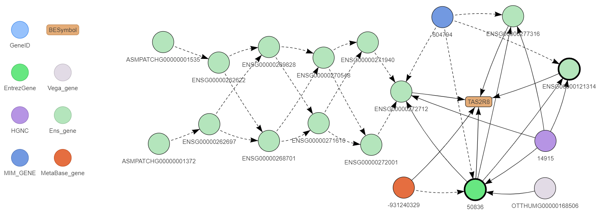

<!----------------------------------------------------------------------------->
<!-- Citations
<!---------------
[@Smith:2012qr].
Multiple entries with a semi-colon: [@Smith:2012qr; @Smith:2013jd].
The default bibliography style uses numerical citations. 
For superscript or author-year citations set the header
metadata field `natbiboptions` to either
`super` or `round`, respectively.
------------------------------------------------------------------------------->

```{r setup, include=FALSE}
reComp <- FALSE
library(knitr)
library(RColorBrewer)
library(VennDiagram)
library(beeswarm)
library(gridExtra)
flog.threshold(futile.logger::ERROR, name = "VennDiagramLogger")
opts_chunk$set(
   include=FALSE,
   warning=FALSE, echo=FALSE, message=FALSE,
   concordance=TRUE
)
bigFormat <- function(x) {format(x, big.mark=",")}
library(BED)
connectToBed(url="localhost:5454", username="neo4j", password="1234")
```

```{r}
## Preprocess bib file
bib <- readLines("BED-References.bib", warn=FALSE)
bib <- gsub("α", "$\\\\alpha$", bib)
write(bib, file="BED-References.bib")
```


\newcommand{\tm}{\textsuperscript{\textregistered}}
\newcommand{\neo}{Neo4j\tm{}}
\newcommand{\cypher}{Cypher\tm{}}
\newcommand{\docker}{Docker\tm{}}
\newcommand{\metabase}{MetaBase\tm{}}


<!----------------------------------------------------------------------------->
<!----------------------------------------------------------------------------->
# Introduction

Since the advent of genome sequencing projects, many technologies have been
developed to get access to different molecular information on a large scale
and with high throughput. DNA micro-arrays are probably the archetype of such
technology because of their historical impact on gathering data related
to nucleic acids: genomic DNA and RNA. They triggered the emergence of
"omics" fields of research such as genomics, epigenomics or transcriptomics.
Lately massive parallel sequencing
further increased the throughput of data generation related to nucleic acids
by several orders of magnitude.
In a different way, mass spectrometry-related technologies allow the
identification and the quantification of many kinds of molecular entities
such as metabolites and proteins.
Many information systems have been developed to manage
the exploding amount of data and knowledge related to biological
molecular entities.
These resources manage different aspects of the data.
For example some are genome or proteome centered, whereas others
are focused on molecular interactions and pathways.
Thus, all these resources rely on different identifier systems to organize
concepts of their interest.
The value of all the experimental data and all the knowledge
collected in public or private resources is very high as such
but is also often synergistically leveraged by their cross comparison
in a dedicated manner. Indeed many data sets can be relevant when
addressing the understanding of a specific biological system, a phenotypic trait
or a disease for example. These data sets can focus on different biological
entities such as transcripts or proteins in different tissues, conditions
or organisms. Comparing all these data and integrating them with
available knowledge requires the ability to map the identifiers on which
each resource relies.

To achieve this task public and proprietary information systems
provide mapping tables between their own identifiers (ID) and those
from other resources.
Furthermore many tools have been developed to facilitate the access
to this information.
Ensembl BioMart [@kinsella_ensembl_2011],
mygene [@wu_biogps_2013],
and g:Profiler [@reimand_g:profiler-web_2016]
are popular examples among many others.
These resources are convenient and easy to use with information
managed by their maintainers.
However, in general (BioMart provides tools to configure marts),
this information cannot be easily customized, optimized
or extended by an empowered user according to his knowledge or to internal,
non-public or non-standard data.
Recognizing these challenges @van_iersel_bridgedb_2010 proposed
the BridgeDb framework providing to bioinformatics developers
a standard interface between tools and
mapping services and also allowing the easy integration of custom data
by a transitivity mechanism. However, to our knowledge,
transitivity in the BridgeDb framework is not leveraged to improve the
completeness of ID conversion (e.g. the number of Ensembl
gene ID actually converted to Entrez gene ID).

Here we present BED: a biological entity dictionary.
BED has been developed to address three main challenges.
The first one is related to the completeness of identifier mappings.
Indeed, direct mapping information provided by the different
systems are not always complete and can be enriched by mappings provided
by other resources. More interestingly, direct mappings not identified by
any of these resources can be indirectly inferred by using mappings to a
third reference. For example, many human Ensembl gene ID are not
directly mapped to any Entrez gene ID but such mappings can be inferred
using respective mappings to HGNC ID.
The second challenge is related to the mapping of deprecated identifiers.
Indeed, entity identifiers can change from one resource release to another.
The identifier history is provided by some resources, such as Ensembl or
the NCBI, but it is generally not used by mapping tools.
The third challenge is related to the automation of the mapping process
according to the relationships between the biological entities of interest.
Indeed, mapping between gene and protein ID scopes should not be done
the same way than between two scopes regarding gene ID.
Also converting identifiers from different organisms should be possible
using gene orthologs information.

To meet these challenges we designed a graph data model describing possible
relationships between different biological entities and their identifiers.
This data model has been implemented with the \neo{} graph
database [@neo4j_inc_neo4j_2017].
Graph databases are very efficient to implement biological data models.
They are more and more used in different fields of application.
For example, they are successfully used for
integrating various
pieces of knowledge [@pareja-tobes_bio4j:_2015, @yoon_use_2017],
describing disease and phenotype relationships [@pareja-tobes_bio4j:_2015]
or modeling molecular networks
and pathways [@dai_hrgrn:_2016, @fabregat_reactome_2018-1].

In addition to the \neo{} graph database,
conversion rules have been defined and coded in
an R [@r_core_team_r:_2017] package. A particular attention has been put
on the efficiency of the tool by implementing a cache system making
recurrent queries fast.

Finally, we provide, for convenience, an instance of the BED database focused
on human, mouse and rat organisms. Nevertheless, many functions are available
in the R package to customize this instance or to construct other instances
tailored to other needs.

<!----------------------------------------------------------------------------->
<!----------------------------------------------------------------------------->
# Methods

## Data model

```{r Data-Model, include=TRUE, out.width='100%', fig.cap = 'The BED graph data model. The model is shown as an Entity/Relationship (ER) diagram: entities correspond to graph nodes and relationships to graph edges. \`\`ID\'\' and \`\`idx\'\' indicate if the corresponding entity property is unique or indexed respectively. Some redundancies occur in this data model. Indeed some \`\`value\'\' properties are duplicated in upper case (\`\`value\\_up\'\') in order to improve the performance of case-insensitive searches. Also the database of a BEID node is provided as a property to ensure uniqueness of the couples of \`\`database\'\' and \`\`value\'\' properties. The same approach has been applied for the \`\`platform\'\' property of ProbeID nodes.'}
include_graphics('img/BED-Data-Model.pdf')
```

The BED (Biological Entity Dictionary) system relies on a data model
inspired by the central dogma of
molecular biology [@crick_central_1970] and describing
relationships between molecular concepts
usually manipulated in the frame of genomics studies
(Figure \@ref(fig:Data-Model)).
A biological entity identifier (*BEID*) can identify either a *Gene* (*GeneID*),
a *Transcript* (*TranscriptID*), a *Peptide* (*PeptideID*) or
an *Object* (*ObjectID*). *Object* entities can correspond to complex concepts
coded by any number of genes (i.e. a protein complex or a molecular function).
*BEID* are extracted from public or private databases (*BEDB*).
*BEDB* can provide an *Attribute* related to each *BEID*.
For example it can be the
sequencing region provided by the Ensembl database [@zerbino_ensembl_2017]
or the identifier
status provided by Uniprot [@the_uniprot_consortium_uniprot:_2017].
*BEID* can have one or several associated names (*BENames*) and symbols
(*BESymbol*). *GeneID* can have one or several homologs in other organisms
belonging to the same *GeneIDFamily*.
Many genomics platforms, such as micro-arrays, allow the identification of
biological entities by using probes identified by *ProbeID*. In general,
*BEID* can be targeted by several probes belonging to a *Platform* which
is focused on one, and only one, type of entity (BEType) among those described
above: *Gene*, *Transcript*, *Peptide* or *Object*.

According to this data model the scope of an identifier is defined by three
features:

   - its type: a *BEType* or "Probe"
   - its source: a database for *BEID*
   or a platform for *ProbeID*
   - the organism to which it refers

A *BEType* can have several
*BEType* products but can be the product of at most one *BEType*.
This constraint allows the unambiguous identification of the most relevant path
to convert identifiers from one scope to another and
is fulfilled by the current data model:
peptides are only produced from transcripts, which are only produced
from genes, which can also code for objects.

*BEID* identifying the same biological entity are related through three
different kinds of relationship according to the information available
in the source databases, and to the decision made by the database administrator
about how to use them. Two *BEID* which *corresponds_to* each other both
*identify* the same biological entity. A *BEID* which *is_associated_to* or
which *is_replaced_by* another *BEID* does not directly
identify any biological entity: the link is always indirect through
one or several other *BEID*. Therefore, by design a *BEID*
which *is_associated_to* or which *is_replaced_by* another *BEID* can be
related to several different biological entities. It is not the case for
other *BEID* which identify one and only one biological entity.
This set of possible relationships allows the indirect mapping of
different identifiers not necessarily provided by any integrated resource.

## Implementation

In order to efficiently leverage an indirect path through these different
relationships the data model has been implemented in
a \neo{} graph database [@neo4j_inc_neo4j_2017].

Two R [@r_core_team_r:_2017] packages have been developed to feed and query
the database.
The first one, neo2R, provides low level functions to interact with
\neo{}. The second R package, BED,
provides functions to feed and query the BED
\neo{} graph database according to the
data model described above.

## Feeding the database

Many functions are provided within the package to build a tailored BED database
instance. These functions are not exported in order not to mislead
the user when querying the database (which is the expected most frequent
usage of the system). An R markdown document showing how to build a BED database
instance for human, mouse and rat organisms is provided within the
package. It can be adapted to other organisms or needs.

Briefly these functions can be divided according to three main levels:

   - The lowest level function is the `bedImport` function
   which loads a table in the \neo{} database according to a \cypher{} query.
   
   - Functions of the second level allow loading identifiers and relationships
   tables ensuring the integrity of the data model:
   
      - `loadBE`, `loadProbes`, `loadOrganisms`, `loadBeAttribute`,
      `loadBEsymbols`, `loadBENames` and `loadBEVersion`
      are used to load information about BEID and ProbeID.
      
      - `loadHistory`, `loadCorrespondsTo`, `loadIsAssociatedTo`,
      `loadIsExpressedAs`,  `loadIsTranslatedIn`, `loadCodesFor`
      and `loadIsHomologOf`are used to load relationships existing
      between BEID and ProbeID.
      
   - Highest level functions are helpers for loading information provided by
   some public resources in different specific formats.
   The following resources are currently supported but other resources can
   be managed by the user by calling the function mentioned above.
      
      - Ensembl [@zerbino_ensembl_2017]:
      `getEnsemblGeneIds`, `getEnsemblTranscriptIds`, `getEnsemblPeptideIds`
      
      - NCBI[@ncbi_resource_coordinators_database_2017]:
      `loadNcbiTax`, `getNcbiGeneTransPep`, `loadNCBIEntrezGOFunctions`
      
      - Uniprot [@the_uniprot_consortium_uniprot:_2017]: `getUniprot`
      
      - Clarivate Analytics \metabase{} [@clarivate_analytics_metacore_2017]:
      `loadMBObjects`
      
## Available database instance

An instance of the BED database (UCB-Human),
built using the script provided
in the BED R package, is available in a \docker{}
image [@docker_inc_docker_2017] available here:
https://hub.docker.com/r/patzaw/bed-ucb-human/ (tag 2018-04-30).
This instance
is focused on *Homo sapiens*, *Mus musculus* and *Rattus norvegicus* organisms
and it has been built from these resources:

- Ensembl [@zerbino_ensembl_2017]
- NCBI [@ncbi_resource_coordinators_database_2017]
- Uniprot [@the_uniprot_consortium_uniprot:_2017]
- biomaRt [@durinck_mapping_2009]
- GEOquery [@davis_geoquery:_2007]
- Clarivate Analytics \metabase{} [@clarivate_analytics_metacore_2017]

The results and the use cases described below were obtained and executed
using this instance of the BED database.

```{r ID-Numbers, include=TRUE, results='asis'}
toShow <- c()
for(be in listBe()){
   for(org in BED::listOrganisms()){
      toAdd <- listBeIdSources(
         be=be,
         organism=org,
         exclude=c("BEDTech_gene", "BEDTech_transcript"),
         verbose=FALSE
      )
      colnames(toAdd) <- c("Database", "nbBE", "BEID", "BE")
      toAdd$Organism <- org
      toShow <- rbind(
         toShow,
         toAdd[,c("BE", "Organism", "Database", "BEID")]
      )
   }
}
urls <- c()
for(i in 1:nrow(toShow)){
   urls <- c(urls, getBeIdURL("", toShow[i, "Database"]))
}
urls <- substr(
   urls, start=1, stop=regexpr("[^/][/][^/].*$", urls)
)
# urls <- sub("^https*[:][/][/]", "", urls)
toShow$URL <- urls
kable(
   toShow,
   row.names=FALSE,
   format='pandoc',
   format.args=list(big.mark=","),
   caption='Numbers of BEID available in the BED UCB-Human database instance.
   Numbers have been split according to the BEType
   and the organism.
   Only BEID which can be mapped to each other are taken into account
   (i.e. excluding deprecated identifiers without successor).'
)
```

```{r, eval=!reComp}
load("~/Tmp/BEIDs-Stats.rda")
```

```{r, eval=reComp}
## Total number of BEID
nbBeIds <- bedCall(
   cypher,
   query <- prepCql(c(
      'MATCH (n:BEID)',
      #'-[:is_replaced_by|is_associated_to*0..]->(:BEID)-[:identifies]->()',
      'WHERE NOT n.database IN ["BEDTech_gene", "BEDTech_transcript"]',
      'RETURN count(distinct n);'
   ))
)
nbProbeIds <- bedCall(
   cypher,
   query <- prepCql(c(
      'MATCH (n:ProbeID)',
      'RETURN count(distinct n);'
   ))
)
save(
   nbBeIds, nbProbeIds,
   file="~/Tmp/BEIDs-Stats.rda"
)
```

The numbers of BEID available in this
BED database instance and which can be mapped to each other are shown
in Table \@ref(tab:ID-Numbers).
In total, `r bigFormat(nbBeIds)` BEID are available in this
BED instance.
This number includes deprecated identifiers without successor and which
therefore cannot be mapped to any other identifier.
All the genomics platforms included in this BED database instance are
shown in Table \@ref(tab:Platforms). They provide mapping to BEID from
`r bigFormat(nbProbeIds)` ProbeID in total.

```{r Platforms, include=TRUE, results='asis'}
toShow <- listPlatforms()
colnames(toShow) <- c("Name", "Description", "BE")
toShow$Description <- sub(" [(].*$", "", toShow$Description)
kable(
   toShow,
   row.names=FALSE,
   format='pandoc',
   caption='Genomics platforms available in the BED UCB-Human database instance.'
)
```

## Transitivity management

In the context of mapping identifiers, transitivity is the inference of
a cross-reference between A and C based on existing cross-references
between and A and B and between B and C.
Depending on how biological entities are defined,
transitivity is desirable or not.
In BED the transitivity mechanism is managed by the two following relationships:
*corresponds_to* and *is_associated_to*. On one hand the *corresponds_to*
relationships make the mapping transitive since two BEIDs which are connected
through this kind of relationship are considered to *identify* the same BE.
On the other hand a BEID which *is_associated_to* another one does not
automatically *identify* the same BE making this kind of relationship not
available for transitive mappings.
When the BED database is fed, the user chooses which relationship should be
of type *corresponds_to* or of type *is_associated_to*.
For example, in the instance described above,
cross-references provided by
Ensembl from Ensembl gene identifiers to Entrez, HGNC and Vega gene identifiers
are considered as *corresponds_to* relationships whereas cross-references to
miRbase, Unigene and OMIM are considered as *is_associated_to* relationships.

## Querying the database

The *BED* R package provides functions
to connect to the \neo{} database (`connectToBed`)
and to directly query it (`bedCall`).
Beside these two functions, others of higher level are provided
to explore available data, to manage identifiers
and to convert them from one scope to another.

Different functions can be used to explore the data model
by listing the type of BE (`listBe`)
or describing their relationships (`firstCommonUpstreamBe`).
Available organisms, databases and platforms can also be retrieved using
`listOrganisms`, `listBeIdSources` and `listPlatforms` functions.

All BEID from a specific scope can be obtained with the `getBeIds` function.
A specific BEID and its relationships with others can be graphically explored
with the `exploreBe` function.
The use and the results of these two functions are exemplified in Use Cases.
Also, the functions `guessIdOrigin` and `checkBeIds` are used to guess and to
check the scope of any list of identifiers.
This set of functions is completed by the `getBeIdSymbols`, `getBeIdNames`,
`getGeneDescription` and `getBeIdDescription` functions
which provide different ways to annotate
identifiers taking advantage of information related to connected BEID.
Other functions, `searchId` and `getRelevantIds`, are also provided
to seek relevant identifiers for a specific
BE. These functions are used by a shiny [@chang_shiny:_2017]
gadget (`findBe`) providing an interactive dictionary of BEID which is also made
available as an Rstudio add-in [@cheng_miniui:_2016; @allaire_rstudioapi:_2017].

As described above, the BED data model has been built to fulfill
molecular biology processes
in order to ensure the biological relevance of identifier mappings.
The *is_expressed_as* and *is_translated_in* relationships correspond
to the transcription  and translation processes respectively
whereas *codes_for* is a fuzzy relationship allowing the mapping
of genes on objects
not necessarily corresponding to the same kind of biological molecules.
These processes are described in different databases with different
levels of granularity. For example, Ensembl [@zerbino_ensembl_2017] provides
possible transcripts for each gene specifying which of them is canonical.
The `getDirectProduct` and `getDirectOrigin` functions allow the user
to retrieve direct products or direct origins
of such molecular biology processes.

The automatic conversion of identifiers from one scope to another is handled
by the `convBeIds` function.
This conversion process can be applied directly
on lists of identifiers (`convBeIdLists`)
or on data frames with an identifier column (`convDfBeIds`).
Because such conversion can be intricate, the `exploreConvPath` function
is provided to display the shortest relevant paths between two identifiers.
These functions are also exemplified in Use Cases.

Converting thousands of identifiers can take some time
(generally a few seconds). Also such conversions are often recurrent and
redundant. In order to improve the performance for such recurrent and redundant
queries, a cache system has been implemented. The first time, the query is run
on \neo{} for all the relevant ID related to user input and the result is saved
in a local file. Next time similar queries are requested, the system does
not call \neo{} but loads the cached results and filters it according
to user input.
By default the cache is flushed when the system detects inconsistencies
with the BED database. If needed, it can also be manually flushed
by using the `lsBedCache` and `clearBedCache` functions.

## Operation

Minimal system requirements for running BED and neo2R R packages:

- **R** $\geq$ 3.4
- **Operating system**: Linux, macOS, Windows
- **Memory** $\geq$ 4GB RAM

The graph database has been implemented
with \neo{} version 3 [@neo4j_inc_neo4j_2017].
The BED R package depends on the following packages available in the
Comprehensive R Archive Network [@cran_comprehensive_nodate]:

- *visNetwork* [@almende_b.v._visnetwork:_2017]
- *dplyr* [@wickham_dplyr:_2017]
- *htmltools* [@rstudio_inc_htmltools:_2017]
- *DT* [@xie_dt:_2016]
- *shiny* [@chang_shiny:_2017]
- *miniUI* [@cheng_miniui:_2016]
- *rstudioapi* [@allaire_rstudioapi:_2017]


<!----------------------------------------------------------------------------->
<!----------------------------------------------------------------------------->
# Results

The results below exemplify how BED efficiently tackle the three challenges
described in the introduction. (1) The way identifiers are managed allow the
mapping of deprecated identifiers. (2) The identifier conversion process takes
advantage of the transitivity mechanism described in Methods to improve
its completeness. (3) Mapping rules between different types of
biological entities (BE) allow the correct and automatic conversion of
identifiers. Finally, BED run time has been compared to three other tools
in different contexts.
These results were obtained using the instance
of the BED database described in Methods and which is available
in Docker Hub: https://hub.docker.com/r/patzaw/bed-ucb-human/
(tag 2018-04-30).

## Management of identifiers

Identifiers (ID) in BED can identify a biological entity (BEID)
or a probe (ProbeID).
The `getBeIds` function returns all ID from a specific scope.
As described in Methods a scope is defined
by its type (the type of BE or "Probe"),
its source (a database for BEID or a platform for ProbeID)
and the organism to which it refers.
For example, the following code
returns all the Ensembl identifiers of human genes.

```{r include=TRUE, echo=TRUE}
beids <- getBeIds(
    be="Gene", source="Ens_gene", organism="human",
    restricted=FALSE
)
head(beids)
```

```{r}
redUnRestIds <- table(table(beids$Gene))
redUnRestIds <- redUnRestIds[order(as.numeric(names(redUnRestIds)))]
ensVersion <- bedCall(
   cypher,
   query=prepCql(c(
      'MATCH (n:BEDB {name:"Ens_gene"}) RETURN n.currentVersion'
   ))
)
```

```{r beidTables, fig.width=6, fig.height=3, out.width='100%', include=TRUE, fig.cap=sprintf('Barplots showing the number (log scale) of gene BE identified by one or more Ensembl gene BEID. a) All Ensembl gene ID. b) Current Ensembl gene ID (version %s).', ensVersion)}
layout(matrix(c(1,1,1,1,2,2,2), 1, 7, byrow = TRUE))
par(mar=c(5.1, 4.5, 1.1, 0.5))
barplot(
   redUnRestIds,
   xlab="Number of BEID",
   ylab="Number of BE", log="y",
   las=2,
   cex.axis=0.7,
   cex.names=0.7
)
mtext(text="(a)", side=2, line=3, at=10^par()$usr[4], las=2, font=2)
##
rbeids <- getBeIds(
    be="Gene", source="Ens_gene", organism="human",
    restricted = TRUE
)
redIds <- table(table(rbeids$Gene))
redIds <- redIds[order(as.numeric(names(redIds)))]
barplot(
   redIds,
   xlab="Number of BEID",
   ylab="Number of BE", log="y",
   las=2,
   cex.axis=0.7,
   cex.names=0.7
)
mtext(text="(b)", side=2, line=3, at=10^par()$usr[4], las=2, font=2)
```

The *id* column corresponds to the BEID from the source of interest.
The column named according to the type of BE (in this case *Gene*)
corresponds to the internal identifiers of the related BE.
This internal identifier is not a stable reference that can be used as such.
Nevertheless, it is useful to identify BEID identifying the
same BE.
In the example above even if most of Gene BE are identified by only
one Ensembl gene BEID, many of them are identified by two or more
(`r bigFormat(sum(redUnRestIds[which(as.numeric(names(redUnRestIds))>=2)]))`
/ `r bigFormat(sum(redUnRestIds))`
$\approx$ `r round(100*sum(redUnRestIds[which(as.numeric(names(redUnRestIds))>=2)])/sum(redUnRestIds))`%);
`r sum(redUnRestIds[which(as.numeric(names(redUnRestIds))>=10)])` BE
are even identified by more than 10 Ensembl BEID
(Figure \@ref(fig:beidTables).a).
In this case, most of these redundancies come from deprecated BEID from former
versions of the Ensembl database (version in use here: `r ensVersion`)
and can be excluded by setting the `restricted` parameter to `TRUE` when calling
the `getBeIds` function (Figure \@ref(fig:beidTables).b).
However many BE are still identified by two or more current Ensembl BEID
(`r bigFormat(sum(redIds[which(as.numeric(names(redIds))>=2)]))`
/ `r bigFormat(sum(redIds))`
$\approx$ `r round(100*sum(redIds[which(as.numeric(names(redIds))>=2)])/sum(redIds))`%).
This result comes from the way the BED database is constructed:
When two BEID from the same resource correspond to the same BEID
in another resource (*correspond_to* relationship in the data model),
all these BEID are considered to identify the same BE.

A complex example of such mapping is shown in Figure \@ref(fig:TAS2R8)
mapping all the BEID of the human TAS2R8 gene which codes for a protein
of the family of candidate taste receptors. There are three identifiers
corresponding to this gene symbol in Ensembl. All these three BEID
correspond to the same Entrez gene and the same HGNC identifiers.
All these BEID are thus considered to identify the same gene. It turns out
that the three Ensembl BEID correspond to the same gene mapped on different
sequence versions of the chromosome 12: the canonical (ENSG00000121314),
CHR_HSCHR12_2_CTG2 (ENSG00000272712)
and CHR_HSCHR12_3_CTG2 (ENSG00000277316).
This information provided by Ensembl is encoded in the *seq_region*
attribute for each Ensembl BEID (see data model)
and is used to define *preferred* BEID which are mapped on canonical versions
of chromosome sequences.
The ENSG00000272712 identifier shows also a complex history in former
Ensembl versions.

```{r TAS2R8, include=TRUE, out.width='100%', fig.cap = 'BED relationships between all the different identifiers of the human TAS2R8 gene recorded in the database. BEID are shown as circle and gene symbol in the rounded box. The color legend is shown to the left of the figure. BEID surrounded in bold correspond to \\emph{preferred} identifiers. Solid arrows represent \\emph{correspond\\_to} (between two nodes of identical shape) and \\emph{is\\_known\\_as} (between two nodes of different shapes) relationships. Dotted arrows represent \\emph{is\\_replaced\\_by} (between two nodes of identical color) and \\emph{is\\_associated\\_to} (between two nodes of different colors) relationships. This graph has been drawn with the \\texttt{exploreBe} function.'}

```

## Converting gene identifiers

```{r, eval=!reComp}
## Save/load results from commmands below to not recompute everything
load("~/Tmp/ConvTables-3rdTools.rda")
```

The main goal of BED is to convert identifiers from one scope to another
easily, rapidly and with high completeness.
It has been thought in order to allow recurring comparisons to each other of
many lists of BEID from various origins.

A simple example regarding the conversion of human Ensembl
gene to human Entrez gene identifiers is shown below and discussed hereafter.
By setting the `restricted` parameter to `TRUE` the converted BEID are
restricted to current - non-deprecated - version of Entrez gene identifiers.
Nevertheless all the input BEID are taken into account,
current and deprecated ones.

```{r, include=TRUE, echo=TRUE, eval=reComp}
bedConv <- convBeIds(
   ids=beids$id, from="Gene", from.source="Ens_gene", from.org="human",
   to.source="EntrezGene", restricted=TRUE
)
```

```{r}
curBeid <- unique(beids$id[which(beids$db.deprecated=="FALSE")])
depBeid <- unique(beids$id[which(beids$db.deprecated!="FALSE")])
```

Among all the `r bigFormat(length(curBeid)+ length(depBeid))`
human Ensembl gene identifiers available in the
database, `r bigFormat(sum(is.na(bedConv$to)))`
(`r round(100*sum(is.na(bedConv$to))/length(unique(bedConv$from)))`%)
were not converted to any human Entrez gene
identifier: `r bigFormat(sum(is.na(bedConv$to[which(bedConv$from %in% curBeid)])))`
(`r round(100*sum(is.na(bedConv$to[which(bedConv$from %in% curBeid)]))/length(curBeid))`%)
of the `r bigFormat(length(curBeid))` non-deprecated
and `r bigFormat(sum(is.na(bedConv$to[which(bedConv$from %in% depBeid)])))`
(`r round(100*sum(is.na(bedConv$to[which(bedConv$from %in% depBeid)]))/length(depBeid))`%)
of the `r bigFormat(length(depBeid))` deprecated identifiers.

```{r, eval=reComp}
## biomaRt
library(biomaRt)
bmEnsembl = useMart("ensembl",dataset="hsapiens_gene_ensembl")
bmConv <- getBM(
   values = unique(beids$id),
   filters = 'ensembl_gene_id',
   attributes=c('ensembl_gene_id', 'entrezgene'),
   mart = bmEnsembl
)

## mygene
library(mygene)
mgConv <- queryMany(
   qterm=unique(beids$id),
   scopes = "ensembl.gene",
   fields="entrezgene",
   species="human"
)

## gProfileR
library(gProfileR)
gpConv <- gconvert(
   query=unique(beids$id),
   target="ENTREZGENE_ACC",
   organism="hsapiens",
   filter_na=FALSE,
   df=FALSE
)
gpConv <- do.call(
   rbind,
   lapply(
      gpConv,
      function(x){
         data.frame(
            alias=as.character(x[,"alias"]),
            target=as.character(x[,"target"]),
            stringsAsFactors=FALSE
         )
      }
   )
)
gpConv$target <- sub("ENTREZGENE_ACC:", "", gpConv$target)
gpConv$target <- ifelse(gpConv$target=="N/A", NA, gpConv$target)
rownames(gpConv) <- c()
gpConv <- unique(gpConv)
```

```{r, eval=reComp}
evalDate <- Sys.Date()
save(
   bedConv, bmConv, mgConv, gpConv, evalDate,
   file="~/Tmp/ConvTables-3rdTools.rda"
)
```

In order to assess the improvement of completeness achieved by BED, we compared
it to three other tools:
biomaRt [@kinsella_ensembl_2011; @durinck_mapping_2009],
mygene [@wu_biogps_2013; @mark_mygene:_2014],
and gProfileR [@reimand_g:profiler-web_2016; @reimand_gprofiler:_2016].
All these tools were used on `r format(evalDate, "%b %d, %Y")`
to perform the same conversion task.
At that time, biomaRt was based on the Ensembl 92 release
(as the BED database instance),
mygene on release 91 and gProfileR on release 90.

```{r}
gq.all <- unique(beids$id)
toComp.all <- list(
   "BED"=unique(bedConv$from[which(!is.na(bedConv$to))]),
   "biomaRt"=unique(bmConv$ensembl_gene_id[which(!is.na(bmConv$entrezgene))]),
   "mygene"=unique(mgConv$query[which(!is.na(mgConv$entrezgene))]),
   "gProfileR"=unique(gpConv$alias[which(!is.na(gpConv$target))])
)
gq.cur <- unique(beids$id[which(beids$db.deprecated=="FALSE")])
toComp.cur <- lapply(
   toComp.all,
   intersect,
   gq.cur
)
```

```{r vennTools, fig.width=10, fig.height=4, out.width='100%', include=TRUE, fig.cap=sprintf('Venn diagrams showing the number of human Ensembl gene identifiers mapped to at least one human Entrez gene identifier by the different tested tools when focusing (a) on all %s or (b) on current %s BEID (Ensembl %s release).', bigFormat(length(gq.all)), bigFormat(length(gq.cur)), ensVersion)}
venn.plot.all <- venn.diagram(
   toComp.all, NULL,
   fill=brewer.pal(4, "Accent"),
   alpha=rep(0.5, 4),
   main="(a)", main.pos=c(0.05,0.95),
   main.fontface=2, main.cex=1.8
)
venn.plot.cur <- venn.diagram(
   toComp.cur, NULL,
   fill=brewer.pal(4, "Accent"),
   alpha=rep(0.5, 4),
   margin=0.1,
   main="(b)", main.pos=c(0.05,0.95),
   main.fontface=2, main.cex=1.8
)
grid.newpage()
grid.arrange(
   gTree(children=venn.plot.all, vp=viewport(width=0.8,height=0.9)),
   gTree(children=venn.plot.cur, vp=viewport(width=0.8,height=0.9)),
   ncol=2
)
```

```{r}
## Exploring mappings only from BED
onlyInBed <- bedConv[
   which(
      !bedConv$from %in% unlist(toComp.all[-1]) &
      !is.na(bedConv$to)
   ),
]
onlyInBedCur <- onlyInBed[
   which(
      onlyInBed$from %in% beids$id[which(beids$db.deprecated=="FALSE")]
   ),
]
onlyInBedDep <- onlyInBed[
   which(onlyInBed$from %in% setdiff(onlyInBed$from, onlyInBedCur$from)),
]
head(onlyInBedDep[order(as.numeric(onlyInBedDep$to)),])
head(onlyInBedCur[order(as.numeric(onlyInBedCur$to)),])
sum(unique(onlyInBedCur$from) %in% beids$id[which(beids$preferred)])
##
fromNcbi <- bedCall(
   cypher,
   query=prepCql(c(
   'MATCH (f:GeneID {database:"Ens_gene"}) WHERE f.value IN $from',
   'MATCH (t:GeneID {database:"EntrezGene"})',
   'MATCH (f)-[:corresponds_to]-(t)',
   'RETURN f.value as from, t.value as to'
)),
   parameters=list(from=as.list(unique(onlyInBedCur$from)))
)
all(
   paste(fromNcbi$from, fromNcbi$to) %in%
      paste(onlyInBedCur$from, onlyInBedCur$to)
)
##
fromHgnc <- bedCall(
   cypher,
   query=prepCql(c(
   'MATCH (f:GeneID {database:"Ens_gene"}) WHERE f.value IN $from',
   'MATCH (i:GeneID {database:"HGNC"})',
   'MATCH (t:GeneID {database:"EntrezGene"})',
   'MATCH (f)-[:corresponds_to]-(i)-[:corresponds_to]-(t)',
   'RETURN f.value as from, t.value as to'
)),
   parameters=list(from=as.list(setdiff(onlyInBedCur$from, fromNcbi$from)))
)
##
remaining <- setdiff(
   onlyInBedCur$from, c(fromHgnc$from, fromNcbi$from)
)
```

```{r}
## Numbers from venn diagram
onlyInGp <- setdiff(
   toComp.all$gProfileR,
   unlist(toComp.all[which(names(toComp.all)!="gProfileR")])
)
onlyInGp.l <- length(onlyInGp)
onlyInMg <- setdiff(
   toComp.all$mygene,
   unlist(toComp.all[which(names(toComp.all)!="mygene")])
)
onlyInMg.l <- length(onlyInMg)
onlyInGpAndMg <- setdiff(
   intersect(toComp.all$gProfileR, toComp.all$mygene),
   unlist(toComp.all[which(!names(toComp.all) %in% c("gProfileR", "mygene"))])
)
onlyInGpAndMg.l <- length(onlyInGpAndMg)
##
onlyInBedAndBm <- setdiff(
   intersect( toComp.all$BED, toComp.all$biomaRt),
   unlist(toComp.all[which(!names(toComp.all) %in% c("BED", "biomaRt"))])
)
onlyInBedAndBm.l <- length(onlyInBedAndBm)
```

The numbers of human Ensembl gene identifiers successfully converted by each
method are compared in Figure \@ref(fig:vennTools).
Mappings returned only by gProfileR or by mygene
(`r onlyInGp.l` + `r onlyInMg.l` + `r onlyInGpAndMg.l`)
are available in releases
90 and 91 of Ensembl respectively but not in release 92.
They probably correspond to deprecated cross-references.
Conversely, mappings returned by both BED and biomaRt but neither by gProfileR
nor mygene
(`r onlyInBedAndBm.l`)
are available in release 92 of Ensembl but not in releases 91 or 90.
All the gene identifiers successfully converted by biomaRt were also
converted by BED.
However, BED was able to map at least
`r bigFormat(length(unique(onlyInBed$from)))` more identifiers than all the
other tools (Figure \@ref(fig:vennTools).a). A few of these mappings
(`r bigFormat(length(unique(onlyInBedDep$from)))`)
are explained by the fact that BED is the only tool mapping
deprecated identifiers to current versions.
Nevertheless, even when focusing on the mapping of current versions of
Ensembl identifiers BED was able to
map `r bigFormat(length(unique(onlyInBedCur$from)))`
more identifiers than all the
other tools (Figure \@ref(fig:vennTools).b).
A few of these mappings (`r bigFormat(length(unique(fromNcbi$from)))`)
are directly provided by the NCBI. But most of them
(`r bigFormat(length(unique(fromHgnc$from)))`)
are inferred from a mapping of the Ensembl and Entrez gene identifiers
to the same HGNC [@gray_genenames.org:_2015] identifier.

```{r}
## Gene locations
## Run "Analyses/S01-gff-processing.R" to generate the rda file used below
load("~/Tmp/gene-locations.rda")
mappings <- list()
## Reference
toAdd <- unique(bmConv[which(
   bmConv$ensembl_gene_id %in% intersect(
      intersect(toComp.all$BED, toComp.all$biomaRt),
      intersect(toComp.all$mygene, toComp.all$gProfileR)
   )
),])
colnames(toAdd) <- c("ensembl", "entrez")
toAdd$ensembl <- as.character(toAdd$ensembl)
toAdd$entrez <- as.character(toAdd$entrez)
toAdd <- toAdd[which(
      toAdd$ensembl %in% ensemblGenes$gene &
         toAdd$entrez %in% entrezGenes$gene
),]
toAdd <- cbind(
   cbind(toAdd, ensemblGenes[toAdd$ensembl,c("chromosome", "start", "stop")]),
   entrezGenes[toAdd$entrez,c("chromosome", "start", "stop")]
)
colnames(toAdd) <- c(
   "ensembl", "entrez",
   "chr.ens", "start.ens", "stop.ens",
   "chr.ncbi", "start.ncbi", "stop.ncbi"
)
mappings$"Reference" <- toAdd
## Former
toAdd <- unique(as.data.frame(mgConv[which(
   mgConv$query %in% setdiff(
      toComp.all$mygene,
      unlist(toComp.all[c("BED", "biomaRt")])
   )
), c("query", "entrezgene")]))
colnames(toAdd) <- c("ensembl", "entrez")
toAdd$ensembl <- as.character(toAdd$ensembl)
toAdd$entrez <- as.character(toAdd$entrez)
toAdd <- toAdd[which(
      toAdd$ensembl %in% ensemblGenes$gene &
         toAdd$entrez %in% entrezGenes$gene
),]
toAdd <- cbind(
   cbind(toAdd, ensemblGenes[toAdd$ensembl,c("chromosome", "start", "stop")]),
   entrezGenes[toAdd$entrez,c("chromosome", "start", "stop")]
)
colnames(toAdd) <- c(
   "ensembl", "entrez",
   "chr.ens", "start.ens", "stop.ens",
   "chr.ncbi", "start.ncbi", "stop.ncbi"
)
mappings$"Former" <- toAdd
##
toAdd <- unique(bedConv[which(
   bedConv$from %in% setdiff(
      toComp.cur$BED,
      unlist(toComp.cur[c("biomaRt", "mygene", "gProfileR")])
   )
), c("from", "to")])
colnames(toAdd) <- c("ensembl", "entrez")
toAdd$ensembl <- as.character(toAdd$ensembl)
toAdd$entrez <- as.character(toAdd$entrez)
toAdd <- toAdd[which(
      toAdd$ensembl %in% ensemblGenes$gene &
         toAdd$entrez %in% entrezGenes$gene
),]
toAdd <- cbind(
   cbind(toAdd, ensemblGenes[toAdd$ensembl,c("chromosome", "start", "stop")]),
   entrezGenes[toAdd$entrez,c("chromosome", "start", "stop")]
)
colnames(toAdd) <- c(
   "ensembl", "entrez",
   "chr.ens", "start.ens", "stop.ens",
   "chr.ncbi", "start.ncbi", "stop.ncbi"
)
mappings$"BED" <- toAdd
```

We assessed the validity of the mappings by comparing the location on the human
genome (GRCh38) of Ensembl gene identifiers as reported by Ensembl
and the location of the corresponding Entrez gene identifiers
as reported by the NCBI. If the mapping between two identifiers is correct
their location on the genome should be identical or highly similar
(only gene identifiers located on canonical versions
of chromosome sequences were considered for this comparison).
We compared the following mapping results:

   - The "Reference" mappings provided by biomaRt for identifiers
   successfully converted
   by all the tools were considered as the reference
   (`r bigFormat(nrow(mappings$"Reference"))` regard genes on canonical versions
   of chromosomes).
   
   - The "Former" mappings provided by mygene for identifiers
   successfully converted by mygene but neither by biomaRt nor BED
   correspond to mappings only available in the former version (91) of Ensembl
   (`r bigFormat(nrow(mappings$"Former"))` regard genes on canonical versions
   of chromosomes).
   
   - The "BED" mappings provided by BED for identifiers
   successfully converted by BED but not by any of the three other tools
   correspond to the mappings achieved mostly thanks
   to transitivity through HGNC identifiers
   (`r bigFormat(nrow(mappings$"BED"))` regard genes on canonical versions
   of chromosomes).
   
```{r geneLocations, fig.width=8.1, fig.height=5.2, out.width='100%', include=TRUE, fig.cap='Comparison of gene locations provided by Ensembl for Ensembl identifiers and by the NCBI for the cross-referenced Entrez identifiers. \`\`Reference\'\' corresponds to mappings provided by biomaRt for identifiers successfully converted by all the tools. \`\`Former\'\' corresponds to mappings provided by mygene for identifers successfully converted by mygene but neither by biomaRt nor BED. \`\`BED\'\' corresponds to mappings provided by BED for identifers successfully converted by BED but not by any of the three other tools. Numbers of considered mappings (N) in each group are indicated (see text for details). a) Proportion of cross-referenced identifiers located on different chromosomes. b) Absolute distance (base pairs) between gene start positions for cross-referenced identifiers located on the same chromosome. c) Absolute difference (base pairs) between gene sizes for cross-referenced identifiers located on the same chromosome. Median and third quartile values are indicated. Outliers are not shown. \`\`BED\'\' and \`\`Former\'\' results are compared to Reference on different boxplots because of scale shift.'}
# par(mfrow=c(1,5))
i <- 10
layout(matrix(c(rep(1,i+1), rep(2,i), rep(3,i-1), rep(4,i), rep(5,i-1)), 1, (i*5)-1, byrow = TRUE))
## Chromosomes
par(mar=c(5.1, 4.5, 1.1, 0.5))
toPlot <- unlist(lapply(
   mappings,
   function(d){
      sum(d$chr.ens!=d$chr.ncbi)/nrow(d)
   }
))
names(toPlot) <- paste0(
   names(toPlot),
   "\n(N=", unlist(lapply(mappings, function(x) bigFormat(nrow(x)))), ")"
)
bp <- barplot(
   toPlot*100,
   ylab=expression("" != "chromosomes (%)"),
   las=3,
   beside=TRUE
)
text(
   bp, 1,
   paste(signif(toPlot*100,2), "%"),
   pos=3,
   srt=90
)
mtext(text="(a)", side=2, line=2.5, at=par()$usr[4], las=2, font=2)
## Starts
par(mar=c(5.1, 4.5, 1.1, 0))
toPlot <- lapply(
   mappings,
   function(d){
      d <- d[which(d$chr.ens==d$chr.ncbi),]
      abs(d$start.ens-d$start.ncbi)
   }
)
names(toPlot) <- paste0(
   names(toPlot),
   "\n(N=", unlist(lapply(mappings, function(x) bigFormat(nrow(x)))), ")"
)
bp <- boxplot(
   toPlot[1:2],
   col="grey",
   outline=FALSE,
   las=3,
   ylab=expression(group("|", Delta(start), "|"))
)
text(
   2, bp$stats[3,2],
   paste(" ", round(bp$stats[3,2])),
   pos=4,
   srt=90
)
text(
   2, bp$stats[4,2],
   paste(" ", round(bp$stats[4,2])),
   pos=4,
   srt=90
)
mtext(text="(b)", side=2, line=2.5, at=par()$usr[4], las=2, font=2)
par(mar=c(5.1, 2.5, 1.1, 0.5))
bp <- boxplot(
   toPlot[c(1,3)],
   col="grey",
   # ylab=expression(group("|", Delta(start), "|")),
   las=3,
   outline=FALSE
)
text(
   1:2, bp$stats[3,],
   paste(" ", round(bp$stats[3,])),
   pos=4,
   srt=90
)
text(
   1:2, bp$stats[4,],
   paste(" ", round(bp$stats[4,])),
   pos=4,
   srt=90
)
## Sizes
par(mar=c(5.1, 4.5, 1.1, 0))
toPlot <- lapply(
   mappings,
   function(d){
      d <- d[which(d$chr.ens==d$chr.ncbi),]
      abs(d$stop.ens-d$start.ens-d$stop.ncbi+d$start.ncbi)
   }
)
names(toPlot) <- paste0(
   names(toPlot),
   "\n(N=", unlist(lapply(mappings, function(x) bigFormat(nrow(x)))), ")"
)
bp <- boxplot(
   toPlot[1:2],
   col="grey",
   outline=FALSE,
   las=3,
   ylab=expression(group("|", Delta(size), "|"))
)
text(
   2, bp$stats[3,2],
   paste(" ", round(bp$stats[3,2])),
   pos=4,
   srt=90
)
text(
   2, bp$stats[4,2],
   paste(" ", round(bp$stats[4,2])),
   pos=4,
   srt=90
)
mtext(text="(c)", side=2, line=2.5, at=par()$usr[4], las=2, font=2)
par(mar=c(5.1, 2.5, 1.1, 0.5))
bp <- boxplot(
   toPlot[c(1,3)],
   col="grey",
   las=3,
   # ylab=expression(group("|", Delta(size), "|")),
   outline=FALSE
)
text(
   1:2, bp$stats[3,],
   paste("  ", round(bp$stats[3,])),
   pos=3,
   srt=90
)
text(
   1:2, bp$stats[4,],
   paste(" ", round(bp$stats[4,])),
   pos=4,
   srt=90
)
```

As shown in Figure \@ref(fig:geneLocations).a,
the proportion of former cross-referenced identifiers ("Former")
located on different
chromosomes is much higher than for the reference ("Reference").
The proportion of BED cross-referenced identifiers ("BED") located on different
chromosomes is higher than for "Reference" but still low.
Figures \@ref(fig:geneLocations).a and b show that inconsistencies
in gene start location and in gene size are much more
important in "Former" mappings than in "Reference" mappings.
Such difference is not observed between the "Reference" mappings and the
additional mappings provided by BED.
These results show that the general quality of "Former" mappings is lower
than the "Reference", which is in agreement with their deprecation.
More interestingly, additional mappings provided by BED
are of similar quality to the "Reference" making their use as valuable.

As shown above, additional mappings between Ensembl and Entrez gene identifiers
inferred thanks to the use of HGNC cross-references by BED are many and of good
quality. However, this transitivity mechanism is not always desirable
depending on how different resources define biological entities.
It is specially true for gene which is an unstable concept as described
by @gerstein_what_2007.
For example, in Entrez the Hs.103110 UniGene identifier is mapped
to [5465](https://www.ncbi.nlm.nih.gov/gene/5465) and
to [150383](https://www.ncbi.nlm.nih.gov/gene/150383)
Entrez gene identifiers which correspond to two different genes
in Entrez (PPARA and CDPF1) but also in
Ensembl ([ENSG00000186951](http://www.ensembl.org/id/ENSG00000186951)
and [ENSG00000205643](http://www.ensembl.org/id/ENSG00000205643))
and in HGNC ([9232](http://www.genenames.org/cgi-bin/gene_symbol_report?hgnc_id=9232)
and [33710](http://www.genenames.org/cgi-bin/gene_symbol_report?hgnc_id=33710)).
These two genes are located closely on the same chromosome but
at different positions and on different directions.
The same feature has been observed for many UniGene identifiers which makes
UniGene unsuitable for transitivity mappings between gene identifiers.
Therefore, in this instance of the BED database, as described in Methods,
cross-references between Ensembl and Unigene gene identifiers are considered
as *is_associated_to* relationships avoiding transitivity.

```{r, eval=FALSE}
## Other examples can be found using the following query
x <- bedCall(
   cypher,
   query='
   MATCH (g2:Gene)<-[:identifies]-(tgid2:GeneID)<-[:is_associated_to]-
   (ogid:GeneID)-[:is_associated_to]->(tgid1:GeneID)-[:identifies]->(g1:Gene)
   OPTIONAL MATCH (tgid1)-[:is_known_as]->(tgn1:BESymbol)
   WHERE g1<>g2 AND tgid1.database=tgid2.database
   RETURN ogid.value, ogid.database, tgid1.value, tgid1.database, tgid2.value,
   tgid2.database, tgn1.value order by tgn1.value;'
)
```

## Mapping rules

Beside cross-referencing identifiers of identical type of BE,
BED uses the biological relationship between genes, transcript and peptides
to convert identifiers across different type of BE.
For example, when converting peptides identifiers from the same species
it uses only mapping done at the peptide level and does not use mapping
to transcripts and genes. This strategy seems to be applied by biomaRt
but not by mygene nor by gProfileR which map, for example,
one Uniprot identifier
to all the Ensembl peptide identifier coded by the same gene.
For example
the [A6NI28](http://www.uniprot.org/uniprot/A6NI28) Uniprot identifier
is unambiguously mapped to the
ENSP00000298815 Ensembl peptide identifier by BED and biomaRt but is
wrongly mapped to
three additional Ensembl peptide identifiers by mygene and gProfileR
([ENSP00000431776](http://www.ensembl.org/id/ENSP00000431776),
[ENSP00000434304](http://www.ensembl.org/id/ENSP00000434304)
and [ENSP00000435961](http://www.ensembl.org/id/ENSP00000435961))
which are encoded by
the same gene ([ENSG00000165895](http://www.ensembl.org/id/ENSG00000165895)).

Furthermore, in biomaRt, mygene and gProfileR, mapping of BEIDs that are not
genes from two different organisms using orthologs information requires at
least two steps: one to find the ortholog genes and the other to find the
relevant BEID.
These two steps are integrated and transparent in BED.

In general, thanks to the BED data model and to mapping rules,
identifier conversions from one scope to another are biologically
relevant and automatic as exemplified in the use case described below.

Because all these indirect mappings can be intricate,
BED provides a function to show the shortest relevant paths between
two different identifiers (Figure \@ref(fig:explConv)).

```{r explConv, include=TRUE, out.width='100%', fig.cap = 'BED conversion shortest path between the ILMN\\_1220595 probe identifier targeting a transcript of the mouse Il17a gene and the Uniprot Q16552 identifier of the human IL17 protein. The legend is shown to the left of the figure. The red arrow represents the \\emph{is\\_homolog\\_of} relationship. BEID surrounded in bold correspond to \\emph{preferred} identifiers. This graph has been drawn with the \\texttt{exploreConvPath} function.'}
include_graphics('img/ILMN_1220595-Conversion.png')
```

## Performance

The time taken by BED to convert different sets of identifiers from one scope
to another has been compared to the time taken by biomaRt, mygene and gProfileR.
Three different queries have been executed
starting from 100 or 20,000 identifiers.

```{r perf, fig.width=8, fig.height=5, out.width='100%', include=TRUE, fig.cap='Comparison of the time taken to convert a set of randomly selected BE identifiers. Random selections of 100 or 20,000 identifiers have been executed 40 times before conversion by each considered tools. BED performance was assessed without using its cache system for all the queries and also using its cache system for queries regarding 20,000 identifers. a) Conversion of 100 Ensembl human gene ID into Entrez gene ID. b) Conversion of 20,000 Ensembl human gene ID into Entrez gene ID. c) Conversion of 100 Uniprot mouse peptide ID into Ensembl transcript ID. d) Conversion of 20,000 Uniprot mouse peptide ID into Ensembl transcript ID. e) Conversion of 100 Affymetrix probe ID into Ensembl mouse peptide ID. f) Conversion of 100 Affymetrix probe ID into Ensembl mouse peptide ID.'}
## The files used below were generated by calling
## the "Analyses/S03-Performance.R" script several times
i <- 10
j <- 2
k <- 2
lm <- c(rep(1,i+k), rep(2,i+j), rep(3,i), rep(4,i+j), rep(5,i), rep(6,i+j))
layout(matrix(lm, 1, length(lm), byrow = TRUE))
################################################################################
par(mar=c(7.1, 4.5, 1.1, 0.1))
bn <- "Human-Genes-Ensembl-Entrez"
main <- "Ensembl Genes to Entrez genes (human)"
n <- 100
toPlot <- list()
for(i in 1:4){
   rdir <- sprintf("Analyses/Perf-Results/Day0%s", i)
   load(sprintf("%s/%s-%s.rda", rdir, bn, n))
   toPlot <- list(
      "BED"=c(toPlot$"BED", bedTC[,"elapsed"]),
      "biomaRt"=c(toPlot$"biomaRt", bmTC[,"elapsed"]),
      "mygene"=c(toPlot$"mygene", mgTC[,"elapsed"]),
      "gProfileR"=c(toPlot$"gProfileR", gpTC[,"elapsed"])
   )
}
## Remove strong outliers probably because of network issue
toPlot <- lapply(
   toPlot,
   function(x){
      x[which(x < median(x)+40*mad(x))]
   }
)
boxplot(
   toPlot,
   ylab="Elapsed time (seconds)",
   # main=paste(n, main),
   col="transparent",
   las=3,
   outline=FALSE
)
beeswarm(
   toPlot,
   col=c("#66C2A5", "#FC8D62", "#8DA0CB", "#E78AC3"),
   add=TRUE,
   corral="random"
)
mtext(text="(a)", side=2, line=2.5, at=par()$usr[4], las=2, font=2)
#############################
par(mar=c(7.1, 2.5, 1.1, 0.1))
n <- 20000
toPlot <- list()
for(i in 1:4){
   rdir <- sprintf("Analyses/Perf-Results/Day0%s", i)
   load(sprintf("%s/%s-%s.rda", rdir, bn, n))
   toPlot <- list(
      "BED"=c(toPlot$"BED", bedTC[,"elapsed"]),
      "BED (cached)"=c(toPlot$"BED (cached)", bedcTC[,"elapsed"]),
      "biomaRt"=c(toPlot$"biomaRt", bmTC[,"elapsed"]),
      "mygene"=c(toPlot$"mygene", mgTC[,"elapsed"]),
      "gProfileR"=c(toPlot$"gProfileR", gpTC[,"elapsed"])
   )
}
## Remove strong outliers probably because of network issue
toPlot <- lapply(
   toPlot,
   function(x){
      x[which(x < median(x)+40*mad(x))]
   }
)
boxplot(
   toPlot,
   # ylab="Elapsed time (seconds)",
   # main=paste(n, main),
   las=3,
   col="transparent",
   outline=FALSE
)
beeswarm(
   toPlot,
   col=c("#66C2A5", "#A6D854", "#FC8D62", "#8DA0CB", "#E78AC3"),
   add=TRUE,
   corral="random"
)
mtext(text="(b)", side=2, line=0.5, at=par()$usr[4], las=2, font=2)
################################################################################
par(mar=c(7.1, 2.5, 1.1, 0.1))
bn <- "Mouse-Peptides-Uniprot-Transcript-Ensembl"
main <- "Uniprot Peptides to Ensembl Transcripts (mouse)"
n <- 100
toPlot <- list()
for(i in 1:4){
   rdir <- sprintf("Analyses/Perf-Results/Day0%s", i)
   load(sprintf("%s/%s-%s.rda", rdir, bn, n))
   toPlot <- list(
      "BED"=c(toPlot$"BED", bedTC[,"elapsed"]),
      "biomaRt"=c(toPlot$"biomaRt", bmTC[,"elapsed"]),
      "mygene"=c(toPlot$"mygene", mgTC[,"elapsed"]),
      "gProfileR"=c(toPlot$"gProfileR", gpTC[,"elapsed"])
   )
}
## Remove strong outliers probably because of network issue
toPlot <- lapply(
   toPlot,
   function(x){
      x[which(x < median(x)+40*mad(x))]
   }
)
boxplot(
   toPlot,
   ylab="Elapsed time (seconds)",
   # main=paste(n, main),
   col="transparent",
   las=3,
   outline=FALSE
)
beeswarm(
   toPlot,
   col=c("#66C2A5", "#FC8D62", "#8DA0CB", "#E78AC3"),
   add=TRUE,
   corral="random"
)
mtext(text="(c)", side=2, line=0.5, at=par()$usr[4], las=2, font=2)
#############################
par(mar=c(7.1, 2.5, 1.1, 0.1))
n <- 20000
toPlot <- list()
for(i in 1:4){
   rdir <- sprintf("Analyses/Perf-Results/Day0%s", i)
   load(sprintf("%s/%s-%s.rda", rdir, bn, n))
   toPlot <- list(
      "BED"=c(toPlot$"BED", bedTC[,"elapsed"]),
      "BED (cached)"=c(toPlot$"BED (cached)", bedcTC[,"elapsed"]),
      "biomaRt"=c(toPlot$"biomaRt", bmTC[,"elapsed"]),
      "mygene"=c(toPlot$"mygene", mgTC[,"elapsed"]),
      "gProfileR"=c(toPlot$"gProfileR", gpTC[,"elapsed"])
   )
}
## Remove strong outliers probably because of network issue
toPlot <- lapply(
   toPlot,
   function(x){
      x[which(x < median(x)+40*mad(x))]
   }
)
boxplot(
   toPlot,
   # ylab="Elapsed time (seconds)",
   # main=paste(n, main),
   las=3,
   col="transparent",
   outline=FALSE
)
beeswarm(
   toPlot,
   col=c("#66C2A5", "#A6D854", "#FC8D62", "#8DA0CB", "#E78AC3"),
   add=TRUE,
   corral="random"
)
mtext(text="(d)", side=2, line=0.5, at=par()$usr[4], las=2, font=2)
################################################################################
par(mar=c(7.1, 2.5, 1.1, 0.1))
bn <- "Mouse-Affy-Peptide-Ensembl"
main <- "Affymetrix Probes to Ensembl Peptide (mouse)"
n <- 100
toPlot <- list()
for(i in 1:4){
   rdir <- sprintf("Analyses/Perf-Results/Day0%s", i)
   load(sprintf("%s/%s-%s.rda", rdir, bn, n))
   toPlot <- list(
      "BED"=c(toPlot$"BED", bedTC[,"elapsed"]),
      "biomaRt"=c(toPlot$"biomaRt", bmTC[,"elapsed"]),
      "mygene"=c(toPlot$"mygene", mgTC[,"elapsed"]),
      "gProfileR"=c(toPlot$"gProfileR", gpTC[,"elapsed"])
   )
}
## Remove strong outliers probably because of network issue
toPlot <- lapply(
   toPlot,
   function(x){
      x[which(x < median(x)+40*mad(x))]
   }
)
boxplot(
   toPlot,
   ylab="Elapsed time (seconds)",
   # main=paste(n, main),
   col="transparent",
   las=3,
   outline=FALSE
)
beeswarm(
   toPlot,
   col=c("#66C2A5", "#FC8D62", "#8DA0CB", "#E78AC3"),
   add=TRUE,
   corral="random"
)
mtext(text="(e)", side=2, line=0.5, at=par()$usr[4], las=2, font=2)
#############################
par(mar=c(7.1, 2.5, 1.1, 0.1))
n <- 20000
toPlot <- list()
for(i in 1:4){
   rdir <- sprintf("Analyses/Perf-Results/Day0%s", i)
   load(sprintf("%s/%s-%s.rda", rdir, bn, n))
   toPlot <- list(
      "BED"=c(toPlot$"BED", bedTC[,"elapsed"]),
      "BED (cached)"=c(toPlot$"BED (cached)", bedcTC[,"elapsed"]),
      "biomaRt"=c(toPlot$"biomaRt", bmTC[,"elapsed"]),
      "mygene"=c(toPlot$"mygene", mgTC[,"elapsed"]),
      "gProfileR"=c(toPlot$"gProfileR", gpTC[,"elapsed"])
   )
}
## Remove strong outliers probably because of network issue
toPlot <- lapply(
   toPlot,
   function(x){
      x[which(x < median(x)+40*mad(x))]
   }
)
boxplot(
   toPlot,
   # ylab="Elapsed time (seconds)",
   # main=paste(n, main),
   las=3,
   col="transparent",
   outline=FALSE
)
beeswarm(
   toPlot,
   col=c("#66C2A5", "#A6D854", "#FC8D62", "#8DA0CB", "#E78AC3"),
   add=TRUE,
   corral="random"
)
mtext(text="(f)", side=2, line=0.5, at=par()$usr[4], las=2, font=2)
```

As shown in Figure \@ref(fig:perf),
BED outperforms mygene and gProfileR in all the tested cases even when not
using its cache system.
It also outperforms biomaRt for converting Affymetrix probe ID into Ensembl
mouse peptide ID (Figures \@ref(fig:perf).e and \@ref(fig:perf).f).
Without using its cache system, BED performs equally well as biomaRt for
converting Ensembl human gene ID into Entrez gene ID
(Figures \@ref(fig:perf).a and \@ref(fig:perf).b).
It outperforms biomaRt for converting 100 Uniprot mouse peptide ID
into Ensembl transcript ID (Figures \@ref(fig:perf).c)
but is outperformed by biomaRt when 20,000
identifiers are considered (Figures \@ref(fig:perf).d).
Nevertheless when cache is used, BED outperforms all the tools whatever the
conversion scenario
(Figures \@ref(fig:perf).b, \@ref(fig:perf).d and \@ref(fig:perf).f).
These results show that BED, as a dedicated and locally available tool,
is a very efficient option to convert large lists of identifiers on the fly
and recurrently.


<!----------------------------------------------------------------------------->
<!----------------------------------------------------------------------------->
# Use Case: comparing transcriptomics data sets

In this use case we show how BED facilitates the comparison of
data sets relying on identifiers with different scopes.
Indeed, the mechanisms implemented in the BED R package make easy the
conversion of a set of identifiers from one scope to any other.
Thus the comparison of data from different genome wide experiments
is straightforward from a technical point of view.

To exemplify this statement we show below how to compare differential expression
data from three experiments addressing the understanding of Psoriasis mechanisms
with different experimental designs and platforms:

   - @nair_genome-wide_2009 compared gene expression data in lesional
   and non-lesional skin from Psoriasis patients using
   Affymetrix GeneChip Human Genome U133 Plus 2.0.
   Starting from published data
   (ArrayExpress (https://www.ebi.ac.uk/arrayexpress) accession number: [E-GEOD-13355](https://www.ebi.ac.uk/arrayexpress/experiments/E-GEOD-13355/))
   we recomputed differential expression between these two groups of samples.

   - @chiricozzi_integrative_2011 measured transcriptomics responses
   to IL-17 and TNF-$\alpha$ cytokines
   in human keratinocytes using Illumina HumanHT-12 v3.0 Expression BeadChips.
   Starting from published data
   ([E-GEOD-24767](https://www.ebi.ac.uk/arrayexpress/experiments/E-GEOD-24767/))
   we recomputed differential expression between keratinocytes
   co-stimulated with both cytokines and controls.
   
   - @swindell_genome-wide_2011 compared gene expression data in lesional
   and non-lesional skink from five psoriasis mouse models using
   Affymetrix GeneChip Mouse Genome 430 2.0.
   Starting from published data
   ([E-GEOD-27628](https://www.ebi.ac.uk/arrayexpress/experiments/E-GEOD-27628/))
   we recomputed differential expression between affected and non-affected
   skin samples.

```{r}
## DE data
## Run "Analyses/S02-Datasets.R" to generate the rda file used below
load("~/Tmp/BED-Comp-UseCase/DEG.rda")
hsSkin.DE <- hsSkin.DE[,c("logFC", "P.Value", "adj.P.Val")]
hsKera.DE <- hsKera.DE[,c("logFC", "P.Value", "adj.P.Val")]
mmSkin.DE <- mmSkin.DE[,c("logFC", "P.Value", "adj.P.Val")]
```

The first rows of these three data tables are shown below.

```{r, include=TRUE, echo=TRUE}
## E-GEOD-13355: Human skin
head(hsSkin.DE, n=3)
## E-GEOD-24767: Human keratinocytes
head(hsKera.DE, n=3)
## E-GEOD-27628: Mouse skin
head(mmSkin.DE, n=3)
```

The aim of the following commands is to allow the comparison of the three
logFC values by converting ProbeID (row names) of one or the other data set.
The function `guessIdOrigin` is used to identify the scope of the different
sets of identifiers.

```{r, include=TRUE, echo=TRUE}
scopes <- data.frame(
   "Human skin"=unlist(guessIdOrigin(rownames(hsSkin.DE), tcLim=1000)),
   "Human keratinocytes"=unlist(guessIdOrigin(rownames(hsKera.DE), tcLim=1000)),
   "Mouse skin"=unlist(guessIdOrigin(rownames(mmSkin.DE), tcLim=1000)),
   stringsAsFactors=FALSE, check.names=FALSE
)
scopes
```

To compare the two human data sets,
the keratinocyte data set can be converted to
the same scope of the skin data set using the `convDfBeIds` function.
After conversion the two data sets can be merged before
computing the correlation between logFC values.

```{r, include=TRUE, echo=TRUE}
## Human skin VS keratinocytes
convHsKera.DE <- convDfBeIds(
   df=hsKera.DE,
   from=scopes["be", "Human keratinocytes"],
   from.source=scopes["source", "Human keratinocytes"],
   from.org=scopes["organism", "Human keratinocytes"],
   to=scopes["be", "Human skin"],
   to.source=scopes["source", "Human skin"],
   to.org=scopes["organism", "Human skin"],
   restricted=TRUE
)
toCompare <- merge(
   hsSkin.DE[,"logFC", drop=FALSE],
   convHsKera.DE[,c("conv.to", "logFC")],
   by.x=0, by.y="conv.to"
)
colnames(toCompare) <- c("ID", "Skin", "Keratinocytes")
round(cor(toCompare$"Skin", toCompare$"Keratinocytes"), 2)
```

A similar procedure can be applied to compare the two skin data sets or to
compare mouse skin and human keratinocytes.

```{r, include=TRUE, echo=TRUE}
## Human skin VS mouse skin
convMmSkin.DE <- convDfBeIds(
   df=mmSkin.DE,
   from=scopes["be", "Mouse skin"],
   from.source=scopes["source", "Mouse skin"],
   from.org=scopes["organism", "Mouse skin"],
   to=scopes["be", "Human skin"],
   to.source=scopes["source", "Human skin"],
   to.org=scopes["organism", "Human skin"],
   restricted=TRUE
)
toCompare <- merge(
   hsSkin.DE[,"logFC", drop=FALSE],
   convMmSkin.DE[,c("conv.to", "logFC")],
   by.x=0, by.y="conv.to"
)
colnames(toCompare) <- c("ID", "Human", "Mouse")
round(cor(toCompare$"Human", toCompare$"Mouse"), 2)

## Mouse skin VS human keratinocytes
conv2HsKera.DE <- convDfBeIds(
   df=hsKera.DE,
   from=scopes["be", "Human keratinocytes"],
   from.source=scopes["source", "Human keratinocytes"],
   from.org=scopes["organism", "Human keratinocytes"],
   to=scopes["be", "Mouse skin"],
   to.source=scopes["source", "Mouse skin"],
   to.org=scopes["organism", "Mouse skin"],
   restricted=TRUE
)
toCompare <- merge(
   mmSkin.DE[,"logFC", drop=FALSE],
   conv2HsKera.DE[,c("conv.to", "logFC")],
   by.x=0, by.y="conv.to"
)
colnames(toCompare) <- c("ID", "Mouse skin", "Human keratinocytes")
round(cor(toCompare$"Mouse skin", toCompare$"Human keratinocytes"), 2)
```

As shown above, converting the identifier scope of transcriptomic data sets
is straightforward and quickly executed using BED.
It makes the comparison (such as correlation analyses performed in this use
case) and the integration of multiple heterogeneous data very easy to achieve.

Additional examples of BED functionalities are provided in the R package
vignette.

<!----------------------------------------------------------------------------->
<!----------------------------------------------------------------------------->
# Conclusions

The appearance of "omics" technologies, biological knowledge databases and
systems biology analytical approaches have opened the possibility to
integrate various data sets to get a better understanding of
biological processes underlying different complex phenotypes
such as diseases.
However, this promising interoperability of data sets  is largely hampered
by the heterogeneity of identifiers used by technical platforms but also
those used by knowledge databases to organize information.
Comparing and integrating all these data
requires the ability to map the identifiers on which each resource relies.
Many tools have been developed to achieve this task
(e.g. @kinsella_ensembl_2011, @wu_biogps_2013, @reimand_g:profiler-web_2016
or @van_iersel_bridgedb_2010).
However, we identified three challenges generally not addressed by the
available tools:
   
   - Information provided by different data sources is not leveraged to increase
   the completeness of identifier conversion.
   - Deprecated identifiers, used in former versions of resources, are not
   available anymore for conversion in up-to-date versions of mapping tools,
   damaging the integration of historical data sets.
   - The mapping between very different scopes of identifiers is either
   difficult to automate or not biologically relevant.

BED is a system dedicated to the mapping between identifiers of molecular
biological entities. It relies on a graph data model implemented with
\neo{} and on rules coded in an R package.
BED leverages mapping information provided by different resources in order
to increase the mapping completeness between each of them.
It also allows the mapping of deprecated identifiers.
Rules are used to automatically convert identifiers from one scope to another
using the most appropriate path.

The intent of BED is to be tailored to specific needs and
beside functions for querying the system the BED R package provides functions
to build custom instances of the database, including internal
or proprietary resources for example.
Database instances can be locally installed or shared across a community.
This design combined with a cache system makes BED efficient for converting
large lists of identifiers from and to a large variety of scopes.
Because of our research field we provide an instance focused on human,
mouse and rat organisms. This database instance can be directly used
in relevant projects but it can also be enriched depending on user or
community needs.

Beside a casual use for analyzing and comparing data in the frame of a
research project, BED can be advantageously employed by systems dealing with
biological and molecular information from heterogeneous sources.
Indeed various pieces of knowledge can be efficiently managed
in their original scope
(e.g. gene ID for genomics or epigenomics data, transcript ID
for transcriptomics data and protein ID for proteomics data).
Thanks to the automatic and fast conversion of identifiers all these
data can then be compared to each other or to any user input.
We do not provide BED API for other languages than R but we expect that
publishing the source code under an open source license (GPL-3)
will encourage other developers to extend or improve it according to their
needs and their expertise.


<!----------------------------------------------------------------------------->
<!----------------------------------------------------------------------------->
# Software availability

Latest source code is available at:

https://github.com/patzaw/BED

https://github.com/patzaw/neo2R

Archived source code as at time of publication:

https://zenodo.org/badge/latestdoi/119707445 [@godard_patzaw/bed:_2018]

https://zenodo.org/badge/latestdoi/119698430 [@godard_patzaw/neo2r:_2018]

Software is available to use under a GPL-3 license


<!----------------------------------------------------------------------------->
<!----------------------------------------------------------------------------->
# Competing interests

No competing interests were disclosed.

# Grant information

This work was entirely supported by UCB Pharma.
The authors declared that no grants were involved in supporting this work.

# Acknowledgments

We are grateful to Frédéric Vanclef, Malte Lucken, Liesbeth François,
Matthew Page,
Massimo de Francesco, and Marina Bessarabova for fruitful discussions
and constructive criticisms.

